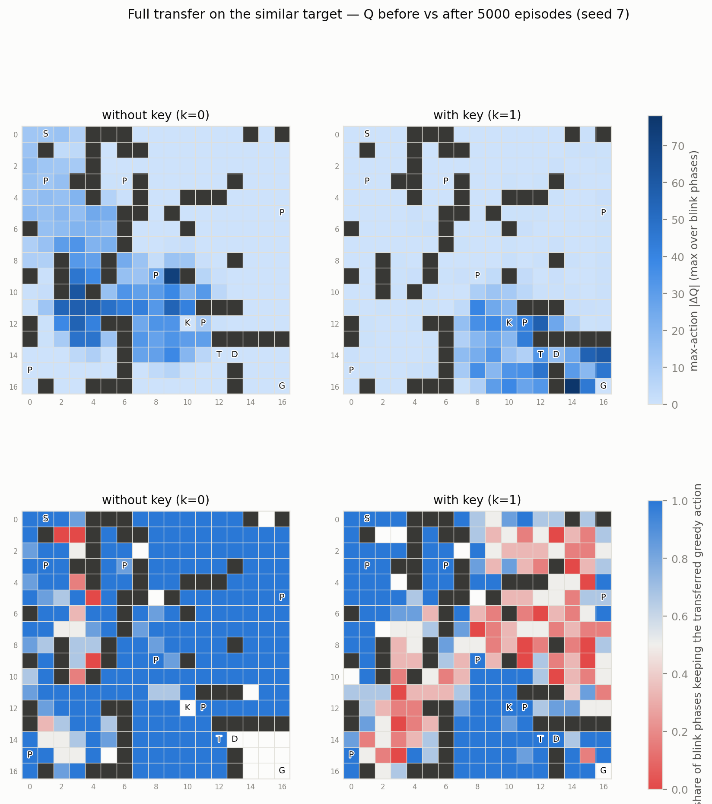
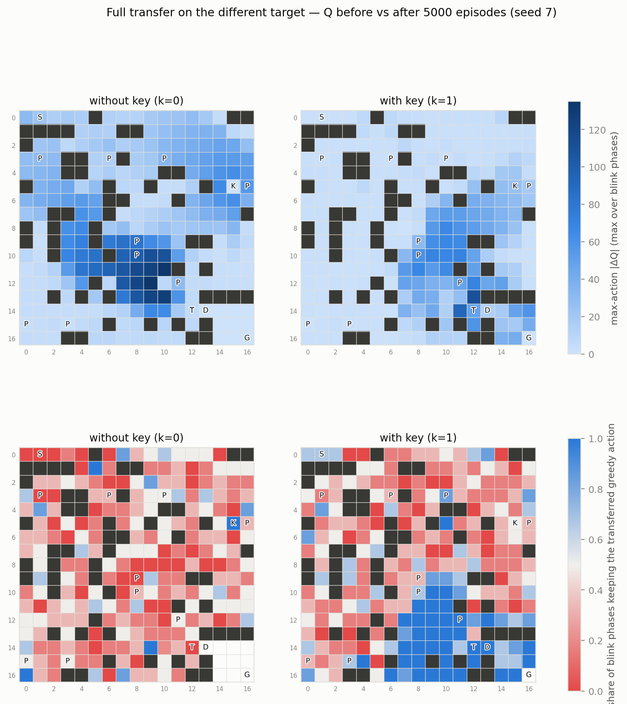

# Design and Analysis of an Intelligent Agent in a Dynamic Maze

**Reinforcement Learning — Final Project · Student ID 40424624**

This report presents the design, implementation and analysis of a dynamic
maze environment modeled as a Markov Decision Process, solved and studied
with three algorithms — Value Iteration, Q-Learning and SARSA(λ) — followed
by a transfer-learning study and an interactive game-style GUI. Every number
below is generated by committed code from committed configuration
([experiments/configs/default.json](experiments/configs/default.json)) and
raw data ([results/raw_data/](results/raw_data/)); the
[README](README.md#reproducing-the-results) gives the exact commands that
reproduce the full artifact set.

---

## 1. Problem setup

Per the specification, the base seed and maze size derive from the student
ID:

```python
student_id = "40424624"
base_seed  = int(student_id[-2])   # = 2
maze_size  = 15 + (base_seed % 4)  # = 17  →  17×17
```

**Chosen dynamic feature: a moving obstacle (مانع متحرک) — the blinking
wizard.** A wizard patrols a fixed blink sequence of period 6 over the
doorway corridor — home on the doorway cell (14,12) for phases 1–3, then
(15,12) at phase 4, (14,10) at phase 5 and (14,11) at phase 0 — teleporting
to the next sequence cell every time step whether or not the agent moves.
Entering the wizard's current cell behaves like a wall bump (stay in
place, −2); the occupancy check uses the *departure* phase, and the wizard
blocks entry only — he never harms an agent whose cell he blinks onto.
This is the moving-obstacle alternative to the **periodic gate** studied
on the `main` branch (whose full artifact set is preserved there). The
gate was originally chosen partly on the argument that "a moving obstacle
is equivalent to the gate but with more states and fiddlier collision
logic"; this branch puts that claim to the test with the state extension
held fixed — the same ×6 phase factor, the same maps, the same rewards —
so that any difference between the two task designs is attributable to
obstacle *mobility* alone. The equivalence claim is evaluated empirically
in §13, and the collision logic turned out to be a one-line predicate,
though the blink sequence itself required one pre-training correction
(§11). Like the gate, the wizard forces genuine *temporal* planning — the
agent must reason about when it arrives, not only where it goes (§3) — the
smallest state extension that gives material for the Markov-property
analysis.

## 2. Environment design

### 2.1 Map generation and validation

The map is generated reproducibly from seed 2
([environments/generator.py](environments/generator.py)): 56/289 cells are
walls (**19.4%**, spec ≥ 15%) and **6 penalty cells** (spec ≥ 5) at (3,1),
(3,6), (5,16), (9,8), (12,11), (15,0). Start (0,1), key (12,10), door
(14,13), goal (16,16), wizard home (14,12):

```
.S..###.......###        S start   K key    D locked door
.####.##.........        G goal    T wizard home   P penalty (pit)
.......#.........        # wall    . floor
.P.##.P#.........
...##..#..###....
....#.####......P
......#..........
..#...#..........
..#..#...........
#.#..#..P........
#.#..............
...........####..
......#...KP.....
......#.....#####
......#.....TD...
P....##......#...
....###......#..G
```

Two structural decisions matter for everything downstream:

1. **The goal sits in a walled chamber whose only entrance is the locked
   door**, so the mission order start → key → door → goal is enforced by
   geometry rather than reward design.
2. **The wizard's home is the single corridor cell in front of the door**,
   and his blink sequence covers that doorway plus all three cells of its
   approach, so every successful episode must interact with him. (This
   placement is inherited from the gate design: a first draft had placed
   the feature on *one* shortest key→door path; an equal-length detour
   existed, which would have let the optimal policy ignore it entirely —
   it was moved to the structural bottleneck. See §11, which also records
   this branch's own correction: the blink *sequence* needed tuning.)

Validity is checked with deterministic BFS: a path start→key must exist
with the door closed, and key→goal with the door open (the wizard's cells
count as passable — the wizard only delays, he never disconnects). Invalid
candidates would be regenerated reproducibly
(`effective_seed = base_seed·1000 + attempt`); seed 2 succeeds at attempt
0, and re-running the generator reproduces
[environments/maps/source.json](environments/maps/source.json)
byte-for-byte.

### 2.2 MDP formalization

| element | definition |
|---|---|
| State space S | `s = (r, c, has_key, phase)`: 233 passable cells × 2 × 6 = **2796 states** |
| Action space A | up, down, left, right (4) |
| Transition P | intended direction with p = 0.8, each perpendicular with p = 0.1; the resulting move is resolved against walls, the locked door (blocked without the key) and the wizard (blocked iff the target cell equals `wizard_cell(phase)` — the blink sequence indexed by the *departure* phase); all blocked outcomes keep the agent in place; `phase` always advances by 1 (mod 6); entering the key cell sets `has_key = 1` |
| Reward R | §2.3 — sparse and potential-shaped variants |
| Discount γ | 0.95 reference; {0.90, 0.95, 0.99} studied in §4 |
| Terminal states | goal cell (any key/phase) |
| Episode cap | 3 × 233 = **699** steps (multiplier in the config) |
| Policy | π(s) → A; deterministic greedy policies are compared across algorithms |

**Markov property.** The spec's minimal state `(x, y, k)` is extended by
exactly the variable the chosen feature requires. Door openness is a
function of `has_key`; the wizard's position is a function of `phase`; with
both in the state, P(s′|s, a) is well defined with no reference to history.
Without `phase`, the *same* (x, y, k) would sometimes be blocked and
sometimes not depending on arrival time — a Markov violation, and Value
Iteration could not even write down its model. This answers analytical
question 1 (§10, Q1).

**Termination vs truncation.** Reaching the goal *terminates* the MDP; the
step cap merely *truncates* an episode. The cap is an episode-length device,
not part of the stationary MDP — Value Iteration correctly ignores it, and
the learning agents' bootstrap term is zeroed only on true termination
(`environments/maze.py` returns separate `terminated`/`truncated` flags).

The environment exposes its exact model via `transitions(s, a)` —
`[(p, s′, r, done), …]` — built from the *same* resolution code that
`step()` samples from, so the model consumed by Value Iteration and the
simulation experienced by the learners can never diverge.

Every step also reports its named events: normal move, wall hit, penalty
entry, key pickup, locked-door attempt, door passage, goal, and timeout —
the spec's minimum loggable set — plus `wizard_blocked` for our dynamic
feature. They reach the persisted logs at two granularities: per-episode
counts in the training CSVs (`wall_hits`, `penalty_entries`,
`wizard_blocked`, `locked_door_attempts`, `door_passes`, `key_picked`,
`success`, `timeout`) and named events on every row of the per-step
update-trace logs (§4, §5.2).

### 2.3 Reward design (two variants)

**Sparse** (the comparison baseline): step −1, wall hit −5, penalty cell
−10, locked-door attempt −2, wizard bump −2, key pickup **+50**, goal
**+200**, door pass 0. The door-pass bonus is zero *on purpose*: any
repeatable positive bonus on a non-terminal cell can be farmed by stepping
back and forth through it (+bonus − 2 step costs per loop); the event is
still logged.

**Shaped**: sparse plus potential-based shaping F = γΦ(s′) − Φ(s) with
Φ(s) = −(remaining BFS mission distance) — distance-to-key +
distance(key→goal) before pickup, distance-to-goal after, Φ(goal) = 0.
Φ is deliberately **continuous at the key pickup**: naive per-subgoal
distances would spike by −γ·dist(key→goal) at the exact moment the agent
achieves the subgoal, punishing success. Because the shaping is
potential-based (Ng et al., 1999) with shaping-γ equal to the agent's γ,
the optimal policy is provably unchanged — verified empirically in §5. As
a numerical check, on the 33-step scripted optimal path the shaped return
exceeds the sparse return by exactly the telescoped potential sum (59.4).

### 2.4 Verification

64 unit tests ([tests/](tests/)) pin the environment down: transition
probabilities sum to 1 for all 2796 × 4 state-action pairs; sampled steps
always lie in the support of the exposed model; empirical action noise is
0.8/0.1/0.1 over 3000 steps; every dynamics rule (wall, door, wizard
occupancy per phase — including the discriminating case of one cell
blocked at some phases and free at others — key-once, penalty, goal
termination, timeout) has its own test; the blink sequence's config
contract (length = period, cells passable) is enforced and tested; the
shaping is proven potential-based and dynamics-preserving; the generator
yields valid maps for all ten possible base seeds; the goal is provably
sealed without the door; and the learning updates themselves are tested
(§4, §5), as are the transfer-table constructions (§7).

---

## 3. Value Iteration

Implemented from scratch (`agents/value_iteration.py`) as Bellman
optimality backups over the exact model, with convergence declared when
max<sub>s</sub> |V<sub>k+1</sub>(s) − V<sub>k</sub>(s)| < 10⁻⁶. NumPy only
vectorizes our own backup over padded transition arrays. The greedy policy
extracted from V* is the reference for both model-free methods.

| γ | sweeps to converge | V(start) | eval success | eval return | eval steps | policy agreement vs γ=0.95 |
|---|---|---|---|---|---|---|
| 0.90 | 80 | −9.78 | 100% | 191.70 | 43.3 | 97.8% |
| 0.95 | 91 | 9.62 | 100% | 191.74 | 43.3 | — (reference) |
| 0.99 | 103 | 119.39 | 100% | 192.32 | 43.6 | 96.7% |

(Evaluation protocol here and throughout: 500 greedy episodes on the
stochastic environment, evaluation seed 999. Runtime is ~0.02–0.03 s per γ.)


The convergence curves show two regimes. For the first ~45 sweeps the
maximum value change plateaus: reward information is still propagating
backward along the ~35-step optimal walk, one step per sweep, so the
largest updates track the step-cost scale rather than shrinking. Once the
value estimates connect start to goal, the contraction mapping takes over
and the error decays geometrically with slope ln γ — visibly steeper for
smaller γ. That is why iterations to threshold grow with γ (80 → 91 → 103):
a larger discount factor contracts more slowly. The threshold line at 10⁻⁶
is the configured stopping criterion.


The value function (max over blink phases) shows the mission structure
directly: without the key (left), value climbs toward the key cell; with it
(right), the gradient re-orients toward the chamber. The k=0 panel shows
high values *inside* the chamber even though those states are unreachable
without a key — the door gates entry, not the goal, so a keyless agent
*placed* there could still finish; this is a property of the state space,
not a bug. Values differ enormously across γ (V(start) from −9.8, where
discounted terminal rewards no longer cover accumulated step costs, to
+119.4) while all three policies are behaviorally near-identical — value
*scale* says nothing about policy *quality*.


This figure is the central evidence that the blinking wizard genuinely
shapes decision-making. Far from the corridor the arrows are
phase-invariant (an agent ten steps away doesn't care where the wizard
stands now — he will have blinked several times by arrival). But at the
chamber approach, the optimal action at the *same cell with the same key
status* differs by phase, and because the obstacle *moves*, the waiting
repertoire is richer than the gate's. At the wait cell (14,11): on phases
0, 4 and 5 the arrow points right, into a doorway that is free on the
move; at phase 3 — one blocked tick left — it *still* points right, a
deliberate −2 bump into the wizard, because the phase rolls over and the
very next move walks through; at phase 2 — two blocked ticks left — it
points down instead, starting a sidestep loop through (15,11)–(15,12)
that re-times the approach for two plain −1 steps, cheaper than two
bumps. The same three behaviors appear mirrored at (15,12) (up / up-bump
at phase 3 / left-sidestep at phases 1–2). And the patrol adds a case the
gate never had: at (14,10), phase 0, the *approach cell ahead* is the
obstacle — the optimal move is to bump the wizard himself and follow one
tick behind him. The mistiming cost is explicit in V: (14,11) with the
key is worth 119.9 at phase 4 and 95.7 at phase 1 — a **24.2**-value
timing penalty, the same magnitude the gate imposed. Value Iteration is
counting steps, bumps and clock ticks exactly.

---

## 4. Q-Learning

Off-policy tabular TD control (`agents/q_learning.py`) with ε-greedy
behavior. Implementation details that matter: greedy tie-breaking is
randomized (with zero-initialized Q a deterministic argmax would always
pick action 0 and bias exploration); the bootstrap `max Q(s′,·)` is zeroed
only on true termination (§2.2); per-state visit counts are tracked and
saved with the Q-table. Hyper-parameters (config): α = 0.1, γ = 0.95,
ε: 1.0 → 0.05, 5000 episodes, seeds {7, 21, 42}.

**Hand-reconstructed update** (required by the spec; from the committed
[q_update_trace.csv](results/raw_data/q_learning/q_update_trace.csv),
episode 2500, α = 0.1, γ = 0.95): at s = (0,1,k=0,p=0), action left,
reward −1, s′ = (0,0,k=0,p=1):

```
target   = r + γ·max Q(s′,·) = −1 + 0.95·(−10.400251) = −10.880239
TD error = target − Q(s,a)   = −10.880239 − (−11.849975) = 0.969736
Q(s,a)  ← −11.849975 + 0.1 · 0.969736 = −11.753002  ✓ (matches the log)
```

### 4.1 ε-decay schedules

| run (3 seeds each) | episodes to 90% success | eval return | VI policy agreement |
|---|---|---|---|
| sparse / linear | ≈1594 | 189.8–191.2 | 57.4–58.8% |
| sparse / exponential | ≈1118 | 187.1–190.6 | 51.7–53.3% |


Exponential decay reaches sustained success ~1.4× earlier because ε
collapses early and the agent exploits sooner — visible in all three
panels, with tight seed bands. The price is coverage: linear decay keeps
exploring longer and ends with visibly higher agreement with the optimal
policy (58% vs 52%) across the state space, while both schedules reach the
same asymptote (100% success, ~190 return). Learning speed and state-space
coverage trade off against each other; neither schedule is "better"
unconditionally.

### 4.2 Sparse vs shaped reward

| run (3 seeds each) | episodes to 90% success | eval return |
|---|---|---|
| sparse / exponential | ≈1118 | 187.1–190.6 |
| shaped / exponential | **≈377** | 189.5–190.4 |


Shaping produces a ~3× jumpstart: the key-found rate saturates almost
immediately (the potential gradient literally points at the key) and 90%
success arrives at episode ≈377 vs ≈1118. Crucially the *final* returns are
statistically identical across all 12 runs — the potential-based invariance
prediction of §2.3, confirmed empirically: shaping accelerated learning
without changing the final policy's quality. Nor did it induce unwanted
behavior: evaluation penalty entries (0.18–0.28/ep), wall hits
(2.1–2.6/ep) and steps (~44–47) are indistinguishable between sparse and
shaped — no loops, no side-reward farming, no penalty over-avoidance.
Wizard bumps vary more across the 12 runs (0.33–0.89/ep) but with no
sparse/shaped pattern: a −2 bump-wait and a two-step sidestep are
near-tied in value (§3), so different converged tables legitimately favor
different waits. Interestingly the sparse- and shaped-trained greedy
policies agree on only 50.2% of jointly-visited states while performing
identically — see the near-tie analysis in §6.


The visit map (log scale, required output) documents where experience
went, and three artifacts confirm the environment semantics: the key cell
has zero k=0 visits because entering it instantly flips `has_key` — it is
never a *decision* state; the chamber has zero keyless visits (structurally
unreachable, §2.1); and with the key, the wizard's corridor is among the
darkest regions — the bottleneck funnels every successful episode, and
waiting out the wizard's stay on the doorway (bumps and sidestep loops
alike) concentrates visits further.

---

## 5. SARSA(λ)

On-policy tabular control with eligibility traces
(`agents/sarsa_lambda.py`): the update target uses Q(s′, a′) for the action
the ε-greedy policy *actually* selects and then executes.
**Replacing traces** were chosen over accumulating: under 20% slip noise
the agent revisits states within an episode, where accumulating traces can
exceed 1 and destabilize high-λ updates by double-counting; replacing caps
eligibility at 1 (Singh & Sutton, 1996). Traces reset per episode and are
pruned below 10⁻⁴ (γλ = 0.855 reaches that floor after ~59 steps; the
traced episode below peaks at 49 active pairs) with negligible numerical
effect. Unit tests verify that λ = 0 reduces *exactly* to one-step SARSA
and that a step-2 TD error updates the step-1 pair by exactly α·δ·γλ.

### 5.1 λ sweep

| λ | episodes to 90% success | late-training return std (seeds) | eval return (seeds) |
|---|---|---|---|
| 0 | 1668 | 31.1 – 34.7 | 186.9 – 189.2 |
| 0.3 | 1373 | 24.2 – 33.9 | 187.3 – 190.3 |
| 0.7 | 1016 | 15.4 – 17.5 | 186.3 – 189.0 |
| 0.9 | **817** | **15.9 – 16.9** | **188.0 – 189.8** |


Learning speed rises monotonically with λ — the four success curves sit in
perfect order, with λ=0.9 reaching sustained success twice as fast as λ=0 —
because each TD error updates the whole recent trajectory instead of a
single state, while λ=0 is both slowest and least stable across seeds
because single-step backups correct distant stale values very slowly.
Stability improves with λ and then *plateaus*: the late-training variance
gap between λ=0.7 and λ=0.9 vanishes (15.4–17.5 vs 15.9–16.9 — a
statistical tie), and λ=0.9 posts the slightly better, tighter final
returns. On this task, then, **λ = 0.9 gives the best balance** — ~2×
faster than λ=0 at no measured stability cost — with λ=0.7 a close,
statistically indistinguishable second on everything but speed
(analytical question 4, §10). The textbook worry that long traces
propagate exploratory-slip deltas backward and inject noise at
convergence did not materialize at λ=0.9 here; §13 returns to which
findings of this kind are robust across task variants and which are
seed-level.

### 5.2 δ and E over one episode


For traced episode 4900 (49 steps; raw data in
[sarsa_step_trace.csv](results/raw_data/sarsa/sarsa_step_trace.csv) and
[sarsa_trace_dump.csv](results/raw_data/sarsa/sarsa_trace_dump.csv)): by
this point values have converged, so δ hovers near zero and spikes only at
stochastic slips. Step 2 is a slip into the border wall (r = −6,
δ = −5.77); the sharpest excursion is the pit passage at steps 25–29,
where a perpendicular slip throws the agent back a row (δ = −12.59), the
forced re-entry into the corridor beside penalty cell (9,8) re-prices the
on-policy danger (δ = −42.55, the episode minimum, on a plain −1 move —
the value drop is anticipated risk, not received reward), the step past
the pit rebounds (δ = +33.98), and a final slip drops the agent into the
pit itself (r = −11, δ = −15.76). The right panel shows the eligibilities
of the first four state-actions as parallel straight lines on the log
axis — exactly (γλ)ᵗ = 0.855ᵗ decay (E(s₀,a₀): 0.855, 0.731, 0.625, …) —
so the step-27 surprise still nudges the previous ~two dozen
state-actions with geometrically decreasing weight. That is
eligibility-trace credit assignment made visible.

---

## 6. Three-algorithm comparison

All three algorithms on the identical map and identical sparse reward;
canonical agents VI (γ=0.95), Q-Learning (sparse/exponential, seed 7),
SARSA(λ=0.7, seed 7 — λ=0.7 is kept as the canonical trace setting for
comparability across the project's branches, though λ=0.9 edged it in
§5.1). Data:
[comparison_summary.csv](results/raw_data/comparison/comparison_summary.csv).

| metric | Value Iteration | Q-Learning | SARSA(0.7) |
|---|---|---|---|
| type | model-based | model-free, off-policy | model-free, on-policy |
| runtime (this machine) | **0.1 s** | 7.5 s | 54.7 s |
| env samples to 90% success | — (has the model) | 578,971 | **523,482** |
| total env samples (5000 eps) | 0 | 835,307 | 768,704 |
| model file size | **103 KB** (V + π) | 271 KB | 274 KB |
| eval return / steps | **191.7 / 43.3** | 189.8 / 46.4 | 186.3 / 45.8 |
| V^π(start), exact | **9.62 = V\*** | 5.66 | 6.42 |
| raw VI agreement (visited states) | — | 53.3% | 52.7% |
| penalty entries / eval episode | 0.252 | **0.248** | 0.274 |

(Absolute runtimes vary with machine load between runs; the *ratios* —
VI ~75× faster than Q-Learning, SARSA's trace loop ~7× Q-Learning — are
stable.)


The two model-free methods traverse the same arc — random-walk timeouts,
takeoff, convergence — with SARSA(0.7) ahead in episodes and samples
(~10% fewer steps to sustained success): its traces buy sample efficiency
at the cost of per-step compute. Value Iteration does not appear on these
axes at all, which *is* the comparison: given the exact transition model
it produces the optimal policy in a tenth of a second and zero samples,
while the model-free methods pay ~520–580k environment interactions for
near-optimal policies. Note also what "near-optimal" means precisely:
evaluated under the exact model, Q-Learning's policy is worth 5.66 at the
start state and SARSA(0.7)'s 6.42, against V* = 9.62 — and the two
quality lenses *disagree* about the runner-up: exact policy evaluation
favors SARSA from the start state while the 500-episode evaluation return
favors Q-Learning (189.8 vs 186.3, SARSA's seed-7 table paying slightly
more penalties and wall bumps along its routes). Both lenses are sharper
than raw action-matching percentages, and the disagreement itself is the
lesson: single-number rankings of near-tied policies are fragile.

**The near-tie effect.** Raw agreement with VI is only ~53% for both
learners even though both collect ~95%+ of the optimal return. The
explanation, computed against exact Q*: **41.1%** of non-terminal states
have a second action within 1.0 of optimal (28.8% within 0.5) — corridors
where two directions are equally good — and noisy tabular estimates break
such ties arbitrarily. Only ~19–20% of actual disagreements are near-ties
(gap < 0.5); the rest sit in rarely-visited off-path states whose large
gaps barely affect V^π(start), because the greedy policy hardly ever
enters them.


The required colored agreement/disagreement maps make the visit-density
story spatial: blue (agreement across blink phases) hugs exactly the
mission corridors — start→key territory in the k=0 panels, key→door→goal
in k=1 — while red scatters over regions the converged policy never needs;
the chamber is blank at k=0 because it is unreachable without the key.
Tabular methods concentrate their accuracy where their experience went;
where data is scarce, the greedy action is close to arbitrary — and it
doesn't matter, because those states are off-policy.


The final-path figure is the on-policy complement to the disagreement
maps: one greedy evaluation episode per algorithm, all under the same
seed-999 slip stream, so any difference between panels is a policy
difference, not luck. The bottom lines are near-identical — VI clears the
level in 41 steps for return 202 (+250 for key and goal, −41 step costs,
−5 for one slip-induced wall bump, −2 for one deliberate wizard bump),
the two learners in 44 steps for 201 (one wall bump each, no wizard
contact) — yet the routes are not: Q-Learning cuts through the interior
corridors around rows 5–9 while VI and SARSA(0.7) hug the west edge down
to row 10. That is the near-tie analysis made visible — different greedy
choices in equally-priced corridors produce paths of near-equal value,
which is why ~53% raw agreement coexists with matching returns. Replaying
each policy's *intended* actions with slips disabled walks exactly **35
moves for all three agents** — the 33-move BFS lower bound plus the same
2-step timing budget the wizard's schedule extracts from everyone — so
the ~6–9 extra realized moves are entirely the price of the 20% slip
rate, not routing waste. The short dead-end spurs are perpendicular slips
followed by an immediate correction — the 0.8/0.1/0.1 dynamics in
action. And every route funnels through ★ → doorway → ◆: this episode VI
happens to pay its wait as a −2 bump while the learners' timing gets
through clean, two equally-priced solutions to the same scheduling
problem (§3). The limitation is inherent: this is a single episode at a
single seed — representative (41–44 steps sits within the 43.3–46.4
eval-mean band of the table above), but the aggregate table, not this
picture, carries the comparison.

**Three sample states**
([comparison_sample_states.csv](results/raw_data/comparison/comparison_sample_states.csv)),
chosen by distinct mechanisms:

1. **Penalty-adjacent, (12,10), k=1, phase 5 — 1174 visits.** The key
   cell at the moment of pickup, with pit (12,11) directly east. VI:
   down — whose perpendicular slips are left/*right*, and a right slip
   lands in the −10 pit; SARSA: left (gap 3.42), whose slips (up/down)
   are pit-free. This is the on-policy safety margin, quantified: SARSA's
   own exploratory slips into the pit during training are priced into its
   Q-values, so it exits the key cell *away* from the danger.
2. **Corridor near-tie, (10,7), k=0, phase 5 — 941 visits.** VI: right;
   Q-Learning: down; gap **0.048**. Two equal-length routes toward key
   country — the "disagreement" is a tie-break formality.
3. **Through the pit, (12,12), k=0, phase 5 — 19 visits.** VI: left,
   *deliberately entering penalty cell (12,11)* — paying −10 through the
   pit is the fastest keyless route to the key next door (Q* 109.9 vs
   91.6 for the detour right); Q-Learning: right, on a Q-row that is
   essentially unlearned noise (all four values ≈ −1) after 19 visits.
   Large errors live where data is scarce — and this same cell returns as
   the negative-transfer case of §7.3, where its transferred
   pit-crossing preference becomes exactly wrong once the key moves.

---

## 7. Transfer learning (Q-Learning)

### 7.1 Target environments

Both targets derive deterministically from the source
(`perturb_map`, BFS-validated; chamber, door, wizard corridor and start
untouched; walls are *moved*, preserving the wall-count constraint):

| | similar target | different target |
|---|---|---|
| walls moved | 11/56 = **19.6%** (spec 15–20%) | 20/56 = **35.7%** (spec ≥ 35%) |
| key | unchanged (12,10) | **relocated to (5,15)** |
| penalty cells | unchanged (6) | **+3 → 9** |

In the different target the old key location becomes a plain corridor — a
built-in negative-transfer trap for any policy trained on the source — and
the new key again sits beside a penalty cell, recreating the risky-pickup
motif in new terrain.

### 7.2 Scenarios and results

Four spec scenarios — scratch (zero Q, baseline), full transfer, scaled
transfer Q₀ = β·Q_source with β ∈ {0.25, 0.5, 0.75}, and selective transfer
(only states whose 3×3 neighborhood is unchanged between maps: 1352 of 2720
source states for the similar target, 672 for the different one). All
scenarios share 5000 episodes, ε 0.3→0.05, 3 seeds. Jumpstart is measured
as greedy evaluation of the initial table *before* any training (200
episodes) — note that scratch is not handicapped by the low ε start,
because a zero-initialized Q with random tie-breaking explores like ε≈1
anyway. Target optima (VI): similar 193.1, different 179.9. (Table:
episodes-to-90% is the median across seeds, final return the seed mean.)

| target | scenario | jumpstart (success / return) | episodes to 90% | final return |
|---|---|---|---|---|
| similar | scratch | 0% / −3670 | 828 | 179.8 |
| similar | full | **100% / −120** | **99** | 183.8 |
| similar | scaled β=0.25 | 100% / −120 | **99** | **190.1** |
| similar | scaled β=0.50 | 100% / −120 | **99** | 188.9 |
| similar | scaled β=0.75 | 100% / −120 | **99** | 185.3 |
| similar | selective | 0% / −2775 | 148 | 185.3 |
| different | scratch | 0% / −3634 | 781 | 163.3 |
| different | full | **0% / −3573** | 710 | 164.7 |
| different | scaled β=0.25 | 0% / −3573 | **472** | 168.2 |
| different | scaled β=0.50 | 0% / −3573 | 505 | 167.8 |
| different | scaled β=0.75 | 0% / −3573 | 603 | 167.0 |
| different | selective | 0% / −3538 | 542 | 165.5 |


On the similar target transfer is unambiguously positive: the transferred
tables succeed in 100% of pre-training greedy episodes (slowly — detouring
around the 11 moved walls explains the −120 return) and sustain 90% success
from the first measurable window (episode 99), ~8× sooner than scratch
(828). Selective transfer, despite failing its jumpstart evaluation (its
partial table has holes exactly where the maps changed), recovers almost
the entire speed advantage (148) — the transferred half of the state space
is the half that still matters.



The spec's before/after-transfer view (full transfer, seed 7,
[saved tables](results/models/transfer/)): per-cell max-action |ΔQ| on
top, and below it the share of blink phases whose greedy action survived
the 5000 target episodes. In Q-space "similar" becomes quantitative:
mean max-action |ΔQ| is 9.9 (k=0) / 5.9 (k=1), and the transferred
greedy action survives in 92% (k=0) / 64% (k=1) of the states carrying
data — the bottom row stays blue along everything the mission actually
uses. What does get rewritten is localized and legible: re-priced detours
around the eleven moved walls (the mid-map band at k=0, peaking at 72.6
near the moved cluster around (9,9)), while the largest k=1 rewrite —
(16,14), in the chamber corner — is not terrain change at all (the
chamber is untouched) but a data refresh: source training had left that
corner's non-greedy actions stale-low (q_down 26.7 at phase 0 against a
refreshed 104.7), target visits pulled them up by as much as 78, and the
greedy action (right, toward the goal) never flipped at any phase. |ΔQ|
magnitude and policy change are different things; the red flecks in the
keep-map are the opposite case — near-tied off-path states whose greedy
action flips on tiny updates, without consequence.


On the different target transfer is no free lunch: the full-transfer
jumpstart is 0% success, barely above scratch — the inherited policy
marches confidently to where the key *used to be*. Learning speed still
improves modestly (710 vs 781 episodes) because the with-key half of the
table and the unchanged corridors remain useful. The full-transfer curve
visibly lags scratch through the early hundreds of episodes before
overtaking: the population-level signature of negative transfer being
unlearned.



The same before/after view on the different target renders negative
transfer as geography. Updates are ~3× larger than on the similar target
(mean max-action |ΔQ| 29.8 at k=0, peaking at 134.9), and the dark
epicenter of the k=0 panel is exactly the **old-key basin** — the peak
cell (12,9) is the old key's immediate neighbor — the region where the
transferred table was most confidently wrong, so every inherited value
had to be torn down; the state dissected in §7.3 sits inside it, and its
greedy action is among the overwritten (left → right). Only 31% of
keyless states keep their transferred greedy action. The with-key half
tells the opposite story and explains why full transfer still beat
scratch: door, chamber and goal are unchanged, and the k=1 panel keeps a
solid blue key→door→goal corridor (45% kept overall, near 100% along the
endgame route) — knowledge that survived the map change intact. Transfer
on this target is simultaneously harmful (keyless navigation) and helpful
(endgame logic); the modest net speed gain is the balance of the two.


The β sweep isolates *transfer intensity*. Two clean facts: first,
**β does not change the jumpstart** — argmax is scale-invariant, so every
β > 0 shares the identical initial greedy policy (identical −3573 in the
data); β acts only through update dynamics, where smaller β is a weaker
prior that TD updates overwrite faster. That is why adaptation speed is
monotone in β here (472 / 505 / 603 episodes for 0.25 / 0.5 / 0.75 —
weakest prior, fastest correction) and why β=0.25 achieves the best
*final* return on the similar target (190.1 vs full's 183.8 —
full-strength stale magnitudes linger). Second, with the 5000-episode
budget every scenario on the different target converges to the same
**tabular asymptote** (163–168 vs the 179.9 optimum, ~62–67 steps vs 50.2
optimal — the familiar ε-floor/fixed-α gap, not a transfer effect):
transfer decides how *fast* the asymptote is reached (up to −40%
episodes), never where it lies.

### 7.3 A negative-transfer case, end to end

Required by the spec: state **(12,12), k=0, phase 3** — two cells from the
old key, directly behind penalty cell (12,11); §6's sample state 3 showed
why the *source*-optimal move here is left, straight through the pit
toward the key next door. From
[transfer_negative_case.csv](results/raw_data/transfer/transfer_negative_case.csv)
(full-transfer run on the different target, Q(s) snapshots during
training):

| episode | Q(up) | Q(down) | Q(left) | Q(right) | greedy |
|---|---|---|---|---|---|
| 0 (transferred) | −1.77 | −2.89 | **−1.07** | −1.14 | **left** |
| 100 | −1.59 | +0.94 | **+14.33** | −1.23 | **left** |
| 500 | −2.04 | −1.27 | −1.58 | **−1.21** | **right** |
| 2500 | −5.65 | −5.93 | −5.22 | **−5.20** | right |
| 5000 | −5.65 | −5.93 | −6.09 | **−5.31** | right |
| target optimal (Q*) | 32.76 | 27.63 | 20.49 | **34.77** | **right** |

The arc has four acts. (1) The transferred greedy action walks **left,
into the penalty cell, toward a key that no longer exists** — the
target-optimal action is right, with an action gap of 14.3. (2) By episode
100 the error has *grown*: bootstrapping from neighboring values that are
still transfer-optimistic briefly amplifies q_left to +14.3 — negative
transfer can compound before it corrects. (3) By episode 500 reality has
extinguished it: q_left collapses and the greedy action flips to the
target-optimal right — and this time the flip sticks through episode
5000. (4) Thereafter the converging policy stops visiting the state; all
four values drift down in lockstep as the estimates go stale together.
The correction happens exactly while the state still matters — then the
state is abandoned. The §7.2 ΔQ map locates this arc spatially: (12,12)
lies inside the dark k=0 rewrite basin centered on the removed key.

---

## 8. The GUI — MazeMario

`python main.py` launches a retro game-style Tkinter visualization
([gui/](gui/), six modules; no threads — a cooperative `after()` loop
drives environment steps, animations and the HUD). Every element is
diegetic: brick walls, thorn-ringed pits the hero falls into (with a rising
red −10), a bobbing sparkling key, a wooden door that slides open, a
princess at the goal — and **the moving obstacle is a wizard who blinks
along his patrol**: each phase change he vanishes in a poof of smoke and
sparkles and materializes hat-first on his next cell, zapping (rings and a
shake) any hero who tries to step onto him, with a HUD readout
(AWAY·n / HOME·n — the phases until the doorway's status flips), making
the chosen dynamic feature the most visually prominent object in the game.

| spec control | GUI element |
|---|---|
| algorithm + source/target environment selection | HERO BRAIN + SELECT WORLD menus |
| training vs evaluation mode | MODE: TRAIN / WATCH |
| start / stop / resume / reset / re-run | START, PLAY/PAUSE, RESTART (+ single-STEP) |
| animation speed | 0.5–4× slider (≥2× fast-forwards training, ~60+ episodes/s) |
| policy display toggle | POLICY overlay — greedy arrows for the agent's *current* key status and blink phase, updating live during training |
| live info: episode, steps, reward, ε, key, recent success rate | HUD: EP · STEPS n/cap · SCORE · ε · KEY · WIN (last 100) |

WATCH mode replays trained policies (VI is solved live for the selected
world; the Q-Learning / SARSA tables load from `results/models/`); TRAIN
mode runs a fresh learner with the config's ε schedule and freezes at the
5000-episode budget (ε shows DONE), after which the hero plays its learned
table greedily. Selecting the source-trained Q-table on the *different*
world shows §7.3's negative transfer live: the hero marches toward the
removed key. TRAIN sessions observed in the GUI track the headless
learning curves of §4 — the game is the same environment and the same
update rules, animated.

---

## 9. Comparison summary

| criterion | Value Iteration | Q-Learning | SARSA(λ=0.7) |
|---|---|---|---|
| needs | full model P, R | env interaction only | env interaction only |
| unit of progress | Bellman sweep | episode | episode |
| output | V*, π* | Q, π | Q, E, π |
| compute for this task | ~0.1 s | ~7.5 s | ~55 s |
| samples for this task | 0 | ~835k steps | ~770k steps |
| optimality reached | exact (proof by contraction) | ~95–99% of V*, asymptote set by ε-floor and fixed α | same class, better by exact evaluation (V^π 6.42 vs 5.66) |
| behavior near danger | risk-neutral optimal | risk-neutral estimates | risk-aware per-state choices (§6 sample 1); aggregate rates within seed noise this run |
| sensitivity studied | γ (§3) | ε schedule, reward shaping (§4) | λ (§5) |

---

## 10. Answers to the analytical questions

**Q1 — Define the problem as a complete MDP; how does the state preserve
the Markov property?** §2.2 gives S, A, P, R, γ, terminals and policy. The
state (r, c, has_key, phase) contains every variable that affects the
future: door passability follows from `has_key`, the wizard's position —
and with it every cell's passability — from `phase`, so P(s′|s,a) needs
no history. Dropping the phase makes the same (x,y,k) behave differently
depending on arrival time — the concrete Markov violation our feature
choice was designed to expose.

**Q2 — on-policy vs off-policy near dangerous cells.** Q-Learning's
off-policy max-target learns values of the *greedy* policy while behaving
exploratorily; SARSA's on-policy target prices its own ε-greedy slips into
Q. The mechanism is visible per-state (§6): sample state 1 is the concrete
exhibit — leaving the key cell, SARSA pays 3.42 of Q* to exit *away* from
the adjacent pit, choosing the action whose slips cannot fall in; and both
learners' penalty-adjacent agreement with VI (65.7% / 60.8%) sits far
above their ~53% global agreement — gaps near danger are sharp, not ties.
The *aggregate* signature, however, did not reproduce on this task
variant: SARSA's greedy-evaluation penalty entries (0.274/ep) came out
above Q-Learning's (0.248) and VI's (0.252) this run, where the gate-task
run on `main` had SARSA lowest. The per-state risk pricing is the robust
finding; single-number event-rate rankings between near-tied policies are
seed-sensitive (§13).

**Q3 — why does VI need the transition model while the others learn
without it?** VI's backup averages over P(s′|s,a) explicitly — it *is* a
computation on the model (here exposed exactly by `transitions()`, §2.2).
The TD methods replace that expectation with sampled transitions: each
`step()` outcome is an unbiased draw from the same distribution. The trade
in this project, measured: with the model, exact optimality in ~0.1 s and
zero samples; without it, ~520–580k environment steps to near-optimal
(§6). Advantage of model-free: it works when the model is unavailable or
unwritable; limitation: sample cost and residual suboptimality concentrated
where experience is scarce. Advantage of model-based: exactness and speed;
limitation: it needs precisely the object that real problems rarely give
you (and our exact model made VI usable as ground truth for grading the
others).

**Q4 — which λ balances learning speed and stability best?** On this task,
λ = 0.9 (§5.1): 817 episodes to sustained success (vs 1668 at λ=0, 1016 at
λ=0.7), late-training variance statistically tied with λ=0.7 (15.9–16.9
vs 15.4–17.5 return std, against 31–35 at λ=0) and the slightly better
final returns (188.0–189.8). The general shape is what matters: speed is
monotone in λ while stability improves and then plateaus over λ=0.7–0.9,
so the best balance sits at the top of that plateau — λ=0.9 here, λ=0.7
on the gate variant of the task, the difference between them within seed
noise both times (§13).

**Q5 — three states where the model-free policy differs from VI, with
local analysis.** §6: (12,10) with the key — a systematic on-policy safety
exit from the key cell away from the adjacent pit (gap 3.42, 1174 visits);
(10,7) — a near-tie between two equal corridors (gap 0.048, 941 visits);
(12,12) keyless — a genuine error where VI's optimal move pays −10
*through* the pit for the shortcut to the key (gap 18.3) and Q-Learning's
19 visits never learned it. Together they show disagreement has three
different causes — risk shaping, tie-breaking, and missing data — and
only the third is a real deficiency.

**Q6 — similar vs different target in transfer.** §7.2: on the similar
target, transferred tables jumpstart at 100% success and cut
episodes-to-90% by ~8× (99 vs 828); on the different target the jumpstart
is 0% (the policy heads to the removed key), learning speed still improves
(710 vs 781 full; 472 at β=0.25, −40%), and negative transfer appears —
concretely reconstructed in §7.3 with Q-value snapshots through its rise,
correction and abandonment. With a converged budget, *final* performance
is scenario-independent (the tabular asymptote); transfer moves only the
speed of getting there. β never changes the initial greedy policy (argmax
scale-invariance) — it tunes how strongly the prior resists correction,
which helps on the similar target (β=0.25 final 190.1) and adapts fastest
when weakest on the different one (episodes monotone in β: 472/505/603).

---

## 11. Limitations and design corrections

**Limitations.**
- Tabular methods with fixed α and an ε floor converge to an asymptote
  measurably below V* (§6, §7.2); closing that gap would need α decay and
  sustained exploration, at much higher sample cost.
- Raw policy-agreement percentages are a weak quality metric in this
  environment (41% of states have near-tied actions); we therefore always
  paired them with exact policy evaluation V^π and action-gap analysis.
- Wall-clock timings vary with machine load between runs (ratios are
  stable and are what we interpret).
- The transfer study follows the spec in using Q-Learning only; whether
  SARSA's safer policies transfer differently is untested here.

**Design corrections made during development** (kept as evidence of
requirement-driven iteration):
- **Feature placement** (inherited from the gate design): a first draft
  put the dynamic feature's cell on one shortest key→door path; an
  equal-length detour bypassed it, so the optimal policy could ignore the
  feature. Moved to the chamber-entrance bottleneck; §3's phase-dependent
  policy validates the fix.
- **Blink-sequence tuning:** the first draft of the wizard's patrol was a
  ping-pong — (14,10) → (14,11) → (14,12) → (15,12) → (14,12) → (14,11) —
  that never held any cell two phases in a row. A validation VI solve run
  *before* any training showed the consequence: with a worst-case wait of
  one phase everywhere, a single deliberate −2 bump is the universally
  optimal way to wait, so the greedy action at the corridor was the same
  at every phase (phase-value spread ~12, half the gate's), and the
  feature would not have shaped the policy at all. The adopted patrol
  holds the doorway for three consecutive phases (mirroring the gate's
  3-of-6 closed), restoring a ~24 spread and a genuinely phase-dependent
  policy (§3) — an hour of training saved by a two-second solve.
- **Shaping unit test:** the first version assumed each s′ occurs once per
  (s,a); in fact the same s′ can occur with different rewards (wall −5 vs
  wizard bump −2, both staying in place). Rewritten to compare full
  outcome distributions.
- **door_pass reward:** initially +20 per passage — farmable (+18 net per
  back-and-forth loop through the open door). Set to 0; the event is still
  logged.

## 12. Reproducibility

All maps, models, CSVs and figures regenerate from the committed code and
config: see [README — Reproducing the results](README.md#reproducing-the-results).
The artifact set on this branch was produced by one complete pipeline run
after the wizard change replaced the gate rule; every experiment rewrites
its full output set, the maps are byte-identical to `main`'s (§2.1), and
map generation and every training run are seeded (training seeds
{7, 21, 42}, evaluation seed 999) — a repeated VI run reproduces its CSV
line-for-line up to the wall-clock runtime fields, which track machine
load. Unit tests: `python -m pytest tests/`

## 13. Design retrospective: is a moving obstacle "equivalent to the gate"?

§1 of the original design dismissed the moving obstacle with a one-line
argument — "equivalent to the gate but with more states and fiddlier
collision logic." This project now exists in three complete versions,
each a one-predicate change in `_resolve`
([maze.py](environments/maze.py)) with its full artifact set re-run:
the periodic gate with departure semantics (`main`), the same gate with
arrival semantics (`future_phase`), and this branch's blinking wizard — a
moving obstacle patrolling the same doorway on the same period, over the
same maps, rewards and state space. That makes the dismissal an
empirically testable claim:

| criterion | gate, departure (`main`) | gate, arrival (`future_phase`) | wizard (this branch) |
|---|---|---|---|
| dynamic rule | doorway blocked in phases 3–5, checked at departure | same, checked on arrival | obstacle at `blink_sequence[phase]`: the doorway in phases 1–3, its approach cells otherwise; departure check |
| cells the feature can block | 1 | 1 | 4 |
| V*(start), γ = 0.95 | 9.60 | 9.56 | 9.62 |
| VI sweeps (γ = 0.95) | 91 | 91 | 91 |
| VI eval return / steps | 191.61 / 43.4 | 191.66 / 43.4 | 191.74 / 43.3 |
| slip-free optimal walk | 33 moves (the BFS floor; no waits) | 35 moves, incl. one deliberate bump | 35 moves, two sidestep ticks, no bumps |
| mistiming penalty at the wait cell | ~24 | ~24 | 24.2 |
| naive reactive rule "advance iff the cell ahead is free" | exactly optimal at the doorway | wrong at 2 of 6 phases | right at the doorway, but not on the approach — the same observation demands bump-wait, sidestep or advance depending on phase |
| Q-Learning episodes to 90% (sparse/exp) | ≈1099 | ≈1162 | ≈1118 |
| SARSA(0.7) episodes to 90% | ≈982 | ≈957 | ≈1016 |
| maps, rewards, state space, GUI controls | — | identical | identical |

**Verdict: the equivalence is real — but it holds by construction, not by
default.** Four observations:

- **Tuned to match, the wizard reproduces the gate almost exactly.** With
  the doorway held for three consecutive phases (mirroring the gate's
  3-of-6 closed), every macroscopic quantity lands within noise of
  `main`: V* differs by +0.02, the sweep count is identical (91), the
  evaluated optimum is identical, and the learners moved by +1.7%
  (Q-Learning) and +3.5% (SARSA) — inside the seed spread, and smaller
  than `future_phase`'s own deviations. Most strikingly, the *spatial
  profile* of the timing penalty matches cell for cell: the per-phase
  value spread along the approach (14,9) → (14,10) → (14,11) → (15,12)
  is 16.0 / 19.6 / 24.2 / 24.8 under the wizard against 15.1 / 19.0 /
  23.9 / 24.4 under the gate (computed from the committed VI models of
  both branches). Even though the wizard can physically stand on four
  different cells, the one-lane corridor makes "blocking the doorway's
  neighbor one tick early" nearly the same constraint as "blocking the
  doorway" — the timing field the agent actually plans against is the
  gate's.
- **But equivalence is a knife-edge property of the occupancy schedule.**
  The first blink sequence (§11) used the same four cells, the same
  period and the same bottleneck, yet produced a task with *half* the
  timing pressure (value spread ~12) and a phase-independent corridor
  policy: because no cell was ever held two phases in a row, a single −2
  bump was the universally optimal wait, and the feature degenerated into
  a small toll. What makes a timed obstacle gate-equivalent is not that
  it periodically blocks the bottleneck but its **longest consecutive
  hold** — the worst-case wait it can impose. A moving obstacle is a gate
  whose "closed interval" is its longest stay; schedule that interval to
  match and the tasks converge, let it collapse to one tick and the
  planning content evaporates. The one-line claim in §1 was true only
  because it implicitly assumed the right schedule.
- **The "fiddlier collision logic" mostly failed to materialize — because
  it was inherited.** The entire mechanical difference is one predicate
  (`target == wizard_cell(phase)`) plus two conventions carried over
  unchanged from the gate: the check happens at the departure phase, and
  the obstacle blocks entry without harming an occupant it lands beside.
  Neither is free in general — `future_phase` exists precisely because
  the departure/arrival choice alone shifts measurable quantities — but
  holding them fixed is what kept this comparison about *mobility* and
  nothing else.
- **Running one study three times is a robustness audit.** Findings that
  reproduced under all three dynamics: shaping's ~3× speedup with
  unchanged final quality; monotone λ speed with an ε-floor asymptote;
  the near-tie structure of the environment (41.1% of states within 1.0
  in Q* — identical to the decimal across branches); transfer's similar
  target jumpstarting at 100% with ~8× speedup; β's argmax-invariant
  jumpstart; and the old-key rewrite basin of negative transfer. Findings
  that flipped between branches while every one of them looked
  publishable in isolation: SARSA's aggregate penalty-entry advantage
  (lowest on `main`, highest here), the λ = 0.7 vs 0.9 stability ranking
  (§5.1), and the eval-return ordering of the two learners (§6). The
  three-way re-run separates properties of the *methods* from accidents
  of one dynamics convention and one seed set — which is, in the end, a
  better argument for the branches' existence than any single verdict.

The gate remains the simplest pedagogical baseline and `main` keeps its
canonical artifact set; this branch shows the moving obstacle earns its
place as a genuinely equivalent — because equivalently scheduled — task
design.
(60 tests).
