# Design and Analysis of an Intelligent Agent in a Dynamic Maze

**Reinforcement Learning — Final Project · Student ID 40424624**

This report presents the design, implementation and analysis of a dynamic
maze environment modeled as a Markov Decision Process, solved and studied
with three algorithms — Value Iteration, Q-Learning and SARSA(λ) — followed
by a transfer-learning study and an interactive game-style GUI. Every number
below is generated by committed code from committed configuration
([experiments/configs/default.json](experiments/configs/default.json)) and
raw data ([results/raw_data/](results/raw_data/)); the
[README](README.md#reproducing-the-results) gives the exact commands that
reproduce the full artifact set.

---

## 1. Problem setup

Per the specification, the base seed and maze size derive from the student
ID:

```python
student_id = "40424624"
base_seed  = int(student_id[-2])   # = 2
maze_size  = 15 + (base_seed % 4)  # = 17  →  17×17
```

**Chosen dynamic feature: the periodic gate (دروازه دوره‌ای).** A gate cell
cycles with period 6 — open during phases {0, 1, 2}, closed during
{3, 4, 5} — and the phase advances every time step whether or not the agent
moves. Entering the closed gate behaves like a wall bump (stay in place,
−2). The gate was chosen over the alternatives because it is the smallest
state extension (×6) that still forces genuine *temporal* planning: the
agent must reason about when it arrives, not only where it goes
(demonstrated in §4). Limited energy would have multiplied the state space
by ~100 while duplicating the required step cap; slippery cells and
teleporters require no state extension at all and therefore give no
material for the Markov-property analysis; a moving obstacle is equivalent
to the gate but with more states and fiddlier collision logic.

## 2. Environment design

### 2.1 Map generation and validation

The map is generated reproducibly from seed 2
([environments/generator.py](environments/generator.py)): 56/289 cells are
walls (**19.4%**, spec ≥ 15%) and **6 penalty cells** (spec ≥ 5) at (3,1),
(3,6), (5,16), (9,8), (12,11), (15,0). Start (0,1), key (12,10), door
(14,13), goal (16,16), gate (14,12):

```
.S..###.......###        S start   K key    D locked door
.####.##.........        G goal    T gate   P penalty (pit)
.......#.........        # wall    . floor
.P.##.P#.........
...##..#..###....
....#.####......P
......#..........
..#...#..........
..#..#...........
#.#..#..P........
#.#..............
...........####..
......#...KP.....
......#.....#####
......#.....TD...
P....##......#...
....###......#..G
```

Two structural decisions matter for everything downstream:

1. **The goal sits in a walled chamber whose only entrance is the locked
   door**, so the mission order start → key → door → goal is enforced by
   geometry rather than reward design.
2. **The gate occupies the single corridor cell in front of the door**, so
   every successful episode must interact with it. (A first draft placed
   the gate on *one* shortest key→door path; an equal-length detour
   existed, which would have let the optimal policy ignore the gate
   entirely — it was moved to the structural bottleneck. See §11.)

Validity is checked with deterministic BFS: a path start→key must exist
with the door closed, and key→goal with the door open (the gate counts as
passable — a closed gate only delays, it never disconnects). Invalid
candidates would be regenerated reproducibly
(`effective_seed = base_seed·1000 + attempt`); seed 2 succeeds at attempt
0, and re-running the generator reproduces
[environments/maps/source.json](environments/maps/source.json)
byte-for-byte.

### 2.2 MDP formalization

| element | definition |
|---|---|
| State space S | `s = (r, c, has_key, gate_phase)`: 233 passable cells × 2 × 6 = **2796 states** |
| Action space A | up, down, left, right (4) |
| Transition P | intended direction with p = 0.8, each perpendicular with p = 0.1; the resulting move is resolved against walls, the locked door (blocked without the key) and the closed gate (blocked in phases 3–5); all blocked outcomes keep the agent in place; `gate_phase` always advances by 1 (mod 6); entering the key cell sets `has_key = 1` |
| Reward R | §2.3 — sparse and potential-shaped variants |
| Discount γ | 0.95 reference; {0.90, 0.95, 0.99} studied in §4 |
| Terminal states | goal cell (any key/phase) |
| Episode cap | 3 × 233 = **699** steps (multiplier in the config) |
| Policy | π(s) → A; deterministic greedy policies are compared across algorithms |

**Markov property.** The spec's minimal state `(x, y, k)` is extended by
exactly the variable the chosen feature requires. Door openness is a
function of `has_key`; gate openness is a function of `gate_phase`; with
both in the state, P(s′|s, a) is well defined with no reference to history.
Without `gate_phase`, the *same* (x, y, k) would sometimes be blocked and
sometimes not depending on arrival time — a Markov violation, and Value
Iteration could not even write down its model. This answers analytical
question 1 (§10, Q1).

**Termination vs truncation.** Reaching the goal *terminates* the MDP; the
step cap merely *truncates* an episode. The cap is an episode-length device,
not part of the stationary MDP — Value Iteration correctly ignores it, and
the learning agents' bootstrap term is zeroed only on true termination
(`environments/maze.py` returns separate `terminated`/`truncated` flags).

The environment exposes its exact model via `transitions(s, a)` —
`[(p, s′, r, done), …]` — built from the *same* resolution code that
`step()` samples from, so the model consumed by Value Iteration and the
simulation experienced by the learners can never diverge.

### 2.3 Reward design (two variants)

**Sparse** (the comparison baseline): step −1, wall hit −5, penalty cell
−10, locked-door attempt −2, gate bump −2, key pickup **+50**, goal
**+200**, door pass 0. The door-pass bonus is zero *on purpose*: any
repeatable positive bonus on a non-terminal cell can be farmed by stepping
back and forth through it (+bonus − 2 step costs per loop); the event is
still logged.

**Shaped**: sparse plus potential-based shaping F = γΦ(s′) − Φ(s) with
Φ(s) = −(remaining BFS mission distance) — distance-to-key +
distance(key→goal) before pickup, distance-to-goal after, Φ(goal) = 0.
Φ is deliberately **continuous at the key pickup**: naive per-subgoal
distances would spike by −γ·dist(key→goal) at the exact moment the agent
achieves the subgoal, punishing success. Because the shaping is
potential-based (Ng et al., 1999) with shaping-γ equal to the agent's γ,
the optimal policy is provably unchanged — verified empirically in §5. As
a numerical check, on the 33-step scripted optimal path the shaped return
exceeds the sparse return by exactly the telescoped potential sum (59.4).

### 2.4 Verification

58 unit tests ([tests/](tests/)) pin the environment down: transition
probabilities sum to 1 for all 2796 × 4 state-action pairs; sampled steps
always lie in the support of the exposed model; empirical action noise is
0.8/0.1/0.1 over 3000 steps; every dynamics rule (wall, door, gate by
phase, key-once, penalty, goal termination, timeout) has its own test; the
shaping is proven potential-based and dynamics-preserving; the generator
yields valid maps for all ten possible base seeds; the goal is provably
sealed without the door; and the learning updates themselves are tested
(§5, §6), as are the transfer-table constructions (§8).

---

## 3. Value Iteration

Implemented from scratch (`agents/value_iteration.py`) as Bellman
optimality backups over the exact model, with convergence declared when
max<sub>s</sub> |V<sub>k+1</sub>(s) − V<sub>k</sub>(s)| < 10⁻⁶. NumPy only
vectorizes our own backup over padded transition arrays. The greedy policy
extracted from V* is the reference for both model-free methods.

| γ | sweeps to converge | V(start) | eval success | eval return | eval steps | policy agreement vs γ=0.95 |
|---|---|---|---|---|---|---|
| 0.90 | 80 | −9.79 | 100% | 191.51 | 43.3 | 97.9% |
| 0.95 | 91 | 9.60 | 100% | 191.61 | 43.4 | — (reference) |
| 0.99 | 102 | 119.43 | 100% | 191.99 | 43.6 | 96.6% |

(Evaluation protocol here and throughout: 500 greedy episodes on the
stochastic environment, evaluation seed 999. Runtime is ~0.02–0.03 s per γ.)

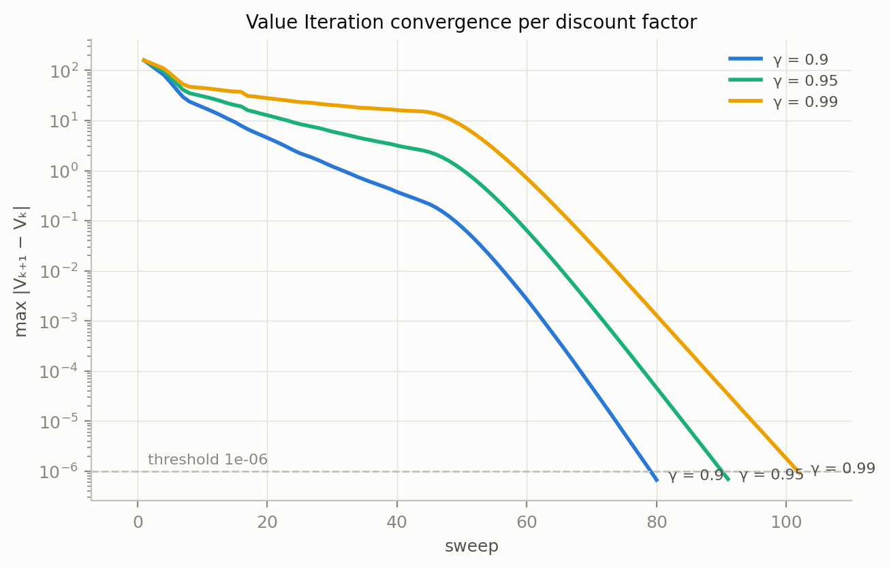

The convergence curves show two regimes. For the first ~45 sweeps the
maximum value change plateaus: reward information is still propagating
backward along the ~33-step optimal path, one step per sweep, so the
largest updates track the step-cost scale rather than shrinking. Once the
value estimates connect start to goal, the contraction mapping takes over
and the error decays geometrically with slope ln γ — visibly steeper for
smaller γ. That is why iterations to threshold grow with γ (80 → 91 → 102):
a larger discount factor contracts more slowly. The threshold line at 10⁻⁶
is the configured stopping criterion.

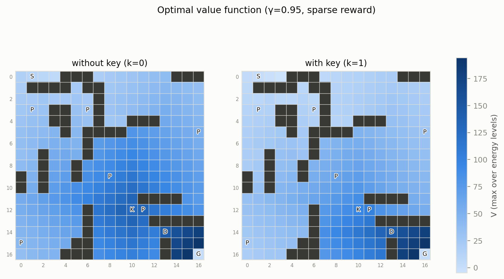

The value function (max over gate phases) shows the mission structure
directly: without the key (left), value climbs toward the key cell; with it
(right), the gradient re-orients toward the chamber. The k=0 panel shows
high values *inside* the chamber even though those states are unreachable
without a key — the door gates entry, not the goal, so a keyless agent
*placed* there could still finish; this is a property of the state space,
not a bug. Values differ enormously across γ (V(start) from −9.8, where
discounted terminal rewards no longer cover accumulated step costs, to
+119.4) while all three policies are behaviorally near-identical — value
*scale* says nothing about policy *quality*.

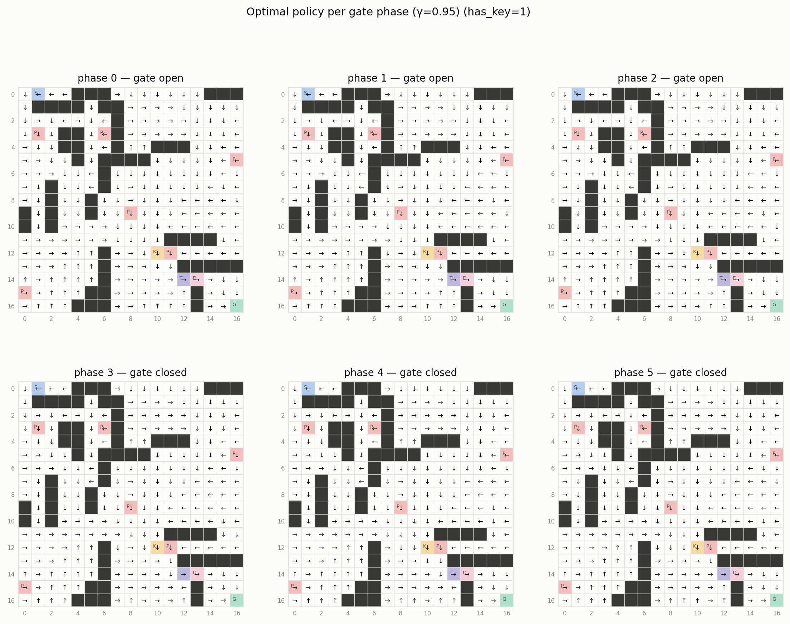

This figure is the central evidence that the periodic gate genuinely shapes
decision-making. Far from the gate the arrows are phase-invariant (an agent
ten steps away doesn't care about the current phase, which will have cycled
by arrival). But at the chamber approach, the optimal action at the *same
cell with the same key status* differs by phase: in open phases 0–2 the
arrows point into the gate; in phases 3–4 they point away (walking a
two-step detour beats paying repeated −2 bumps — arriving at phase 3 is
worth 96.1 vs 119.9 at phase 0, a ~24-value timing penalty); and at phase 5
the optimal move is to bump the closed gate *once* deliberately, because
the phase rolls over and the very next move walks through. One cheap bump
beats a detour — Value Iteration is counting steps exactly.

---

## 4. Q-Learning

Off-policy tabular TD control (`agents/q_learning.py`) with ε-greedy
behavior. Implementation details that matter: greedy tie-breaking is
randomized (with zero-initialized Q a deterministic argmax would always
pick action 0 and bias exploration); the bootstrap `max Q(s′,·)` is zeroed
only on true termination (§2.2); per-state visit counts are tracked and
saved with the Q-table. Hyper-parameters (config): α = 0.1, γ = 0.95,
ε: 1.0 → 0.05, 5000 episodes, seeds {7, 21, 42}.

**Hand-reconstructed update** (required by the spec; from the committed
[q_update_trace.csv](results/raw_data/q_learning/q_update_trace.csv),
episode 2500, α = 0.1, γ = 0.95): at s = (0,1,k=0,p=0), action left,
reward −1, s′ = (0,0,k=0,p=1):

```
target   = r + γ·max Q(s′,·) = −1 + 0.95·(−11.006227) = −11.455916
TD error = target − Q(s,a)   = −11.455916 − (−13.278179) = 1.822263
Q(s,a)  ← −13.278179 + 0.1 · 1.822263 = −13.095952  ✓ (matches the log)
```

### 4.1 ε-decay schedules

| run (3 seeds each) | episodes to 90% success | eval return | VI policy agreement |
|---|---|---|---|
| sparse / linear | ≈1546 | 190.8–191.6 | 57.9–58.6% |
| sparse / exponential | ≈1099 | 189.4–190.5 | 51.2–51.9% |

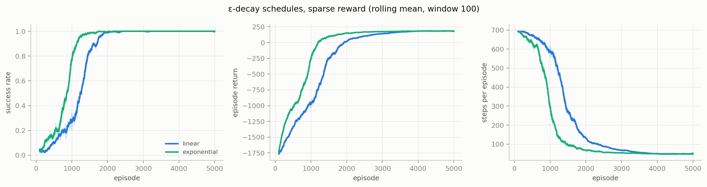

Exponential decay reaches sustained success ~1.4× earlier because ε
collapses early and the agent exploits sooner — visible in all three
panels, with tight seed bands. The price is coverage: linear decay keeps
exploring longer and ends with visibly higher agreement with the optimal
policy (58% vs 51%) across the state space, while both schedules reach the
same asymptote (100% success, ~190 return). Learning speed and state-space
coverage trade off against each other; neither schedule is "better"
unconditionally.

### 4.2 Sparse vs shaped reward

| run (3 seeds each) | episodes to 90% success | eval return |
|---|---|---|
| sparse / exponential | ≈1099 | 189.4–190.5 |
| shaped / exponential | **≈380** | 189.2–190.6 |

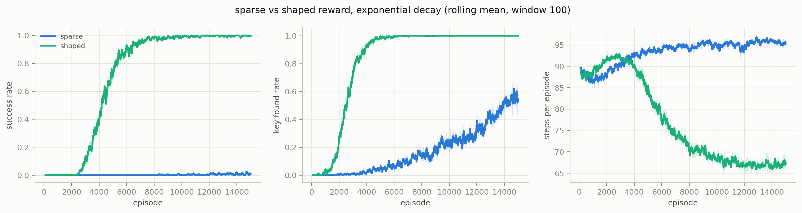

Shaping produces a ~3× jumpstart: the key-found rate saturates almost
immediately (the potential gradient literally points at the key) and 90%
success arrives at episode ≈380 vs ≈1099. Crucially the *final* returns are
statistically identical across all 12 runs — the potential-based invariance
prediction of §2.3, confirmed empirically: shaping accelerated learning
without changing the final policy's quality. Nor did it induce unwanted
behavior: evaluation penalty entries (0.21–0.27/ep), wall hits
(2.2–2.5/ep), gate bumps (0.22–0.45/ep) and steps (~44–46) are
indistinguishable between sparse and shaped — no loops, no side-reward
farming, no penalty over-avoidance. Interestingly the sparse- and
shaped-trained greedy policies agree on only 49.3% of jointly-visited
states while performing identically — see the near-tie analysis in §6.

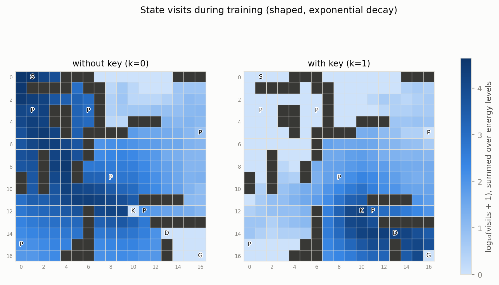

The visit map (log scale, required output) documents where experience
went, and three artifacts confirm the environment semantics: the key cell
has zero k=0 visits because entering it instantly flips `has_key` — it is
never a *decision* state; the chamber has zero keyless visits (structurally
unreachable, §2.1); and with the key, the gate/door corridor is among the
darkest regions — the bottleneck funnels every successful episode, and
closed-gate waiting concentrates visits further.

---

## 5. SARSA(λ)

On-policy tabular control with eligibility traces
(`agents/sarsa_lambda.py`): the update target uses Q(s′, a′) for the action
the ε-greedy policy *actually* selects and then executes.
**Replacing traces** were chosen over accumulating: under 20% slip noise
the agent revisits states within an episode, where accumulating traces can
exceed 1 and destabilize high-λ updates by double-counting; replacing caps
eligibility at 1 (Singh & Sutton, 1996). Traces reset per episode and are
pruned below 10⁻⁴, bounding the active set to ~60 pairs at γλ = 0.855 with
negligible numerical effect. Unit tests verify that λ = 0 reduces *exactly*
to one-step SARSA and that a step-2 TD error updates the step-1 pair by
exactly α·δ·γλ.

### 5.1 λ sweep

| λ | episodes to 90% success | late-training return std (seeds) | eval return (seeds) |
|---|---|---|---|
| 0 | 1670 | 26.0 – 72.0 | 185.1 – 188.1 |
| 0.3 | 1334 | 22.6 – 45.4 | 187.6 – 190.7 |
| 0.7 | 982 | **16.5 – 24.4** | **189.5 – 190.8** |
| 0.9 | **805** | 16.5 – 31.6 | 187.0 – 189.1 |

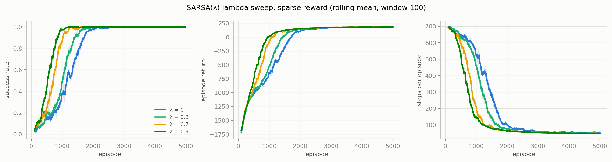

Learning speed rises monotonically with λ — the four success curves sit in
perfect order, with λ=0.9 reaching sustained success twice as fast as λ=0 —
because each TD error updates the whole recent trajectory instead of a
single state. But speed is not the whole story: λ=0.9's long traces also
propagate the deltas of *exploratory slips* backward, injecting noise at
convergence (higher late-run variance, slightly lower finals), while λ=0
is both slowest and least stable across seeds because single-step backups
correct distant stale values very slowly. **λ = 0.7 gives the best
balance** — ~1.7× faster than λ=0 with the lowest, most consistent late
variance and the best final returns (analytical question 4, §10).

### 5.2 δ and E over one episode

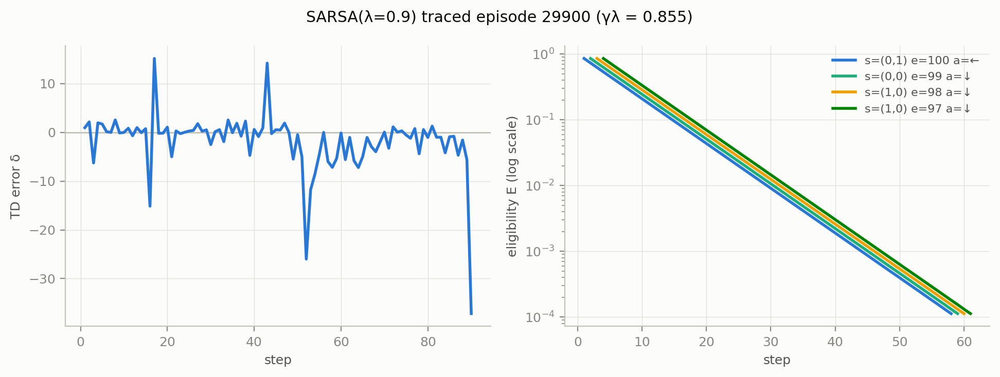

For traced episode 4900 (49 steps; raw data in
[sarsa_step_trace.csv](results/raw_data/sarsa/sarsa_step_trace.csv) and
[sarsa_trace_dump.csv](results/raw_data/sarsa/sarsa_trace_dump.csv)): by
this point values have converged, so δ hovers near zero and spikes only at
stochastic slips — sharply negative (≈−43) when a slip produces a
worse-than-expected outcome (wall/penalty), positive (≈+27) on
better-than-expected recoveries. Concretely, steps 1–2 were perpendicular
slips into the border (r = −6, δ = −8.68 and −4.28), while steps 4–6 were
productive corridor moves with small positive deltas (+1.28, +2.88, +1.40).
The right panel shows the eligibilities of the first four state-actions as
parallel straight lines on the log axis — exactly (γλ)ᵗ = 0.855ᵗ decay
(E(s₀,a₀): 0.855, 0.731, 0.625, 0.534, …) — so a surprise at step 10 still
nudges the previous ~two dozen state-actions with geometrically decreasing
weight. That is eligibility-trace credit assignment made visible.

---

## 6. Three-algorithm comparison

All three algorithms on the identical map and identical sparse reward;
canonical agents VI (γ=0.95), Q-Learning (sparse/exponential, seed 7),
SARSA(λ=0.7, seed 7). Data:
[comparison_summary.csv](results/raw_data/comparison/comparison_summary.csv).

| metric | Value Iteration | Q-Learning | SARSA(0.7) |
|---|---|---|---|
| type | model-based | model-free, off-policy | model-free, on-policy |
| runtime (this machine) | **0.1 s** | 7.8 s | 54.1 s |
| env samples to 90% success | — (has the model) | 612,908 | **526,282** |
| total env samples (5000 eps) | 0 | 850,601 | 769,145 |
| model file size | **103 KB** (V + π) | 271 KB | 274 KB |
| eval return / steps | **191.6 / 43.4** | 190.0 / 45.6 | 190.6 / 44.4 |
| V^π(start), exact | **9.60 = V\*** | 5.93 | 7.83 |
| raw VI agreement (visited states) | — | 51.4% | 51.9% |
| penalty entries / eval episode | 0.260 | 0.236 | **0.188** |

(Absolute runtimes vary with machine load between runs; the *ratios* —
VI ~70–80× faster than Q-Learning, SARSA's trace loop ~7× Q-Learning — are
stable.)

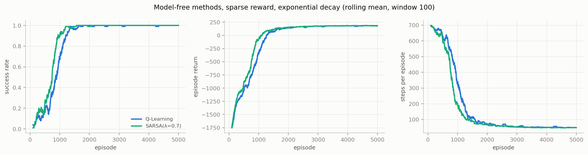

The two model-free methods traverse the same arc — random-walk timeouts,
takeoff, convergence — with SARSA(0.7) consistently ahead in episodes and
samples (~14% fewer steps to sustained success): its traces buy sample
efficiency at the cost of per-step compute. Value Iteration does not appear
on these axes at all, which *is* the comparison: given the exact
transition model it produces the optimal policy in a tenth of a second and
zero samples, while the model-free methods pay ~500–600k environment
interactions for near-optimal policies. Note also what "near-optimal"
means precisely: evaluated under the exact model, Q-Learning's policy is
worth 5.93 at the start state and SARSA(0.7)'s 7.83, against V* = 9.60 —
SARSA's learned policy is genuinely better here despite nearly identical
raw agreement, so exact policy evaluation is a far sharper lens than
action-matching percentages.

**The near-tie effect.** Raw agreement with VI is only ~51% for both
learners even though both collect ~95%+ of the optimal return. The
explanation, computed against exact Q*: **41.1%** of non-terminal states
have a second action within 1.0 of optimal (28.6% within 0.5) — corridors
where two directions are equally good — and noisy tabular estimates break
such ties arbitrarily. Only ~19% of actual disagreements are near-ties
(gap < 0.5); the rest sit in rarely-visited off-path states whose large
gaps barely affect V^π(start), because the greedy policy hardly ever
enters them.

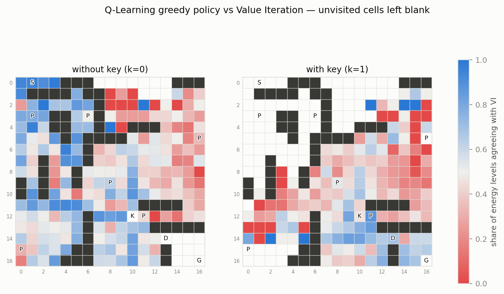
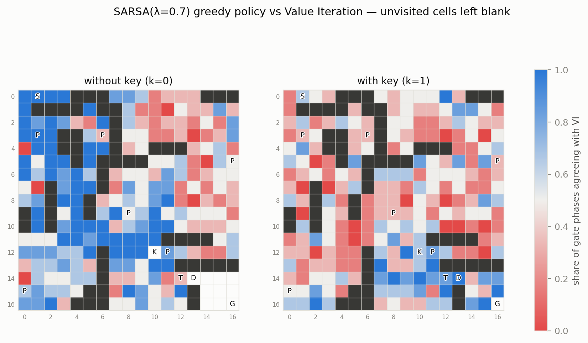

The required colored agreement/disagreement maps make the visit-density
story spatial: blue (agreement across gate phases) hugs exactly the
mission corridors — start→key territory in the k=0 panels, key→door→goal
in k=1 — while red scatters over regions the converged policy never needs;
the chamber is blank at k=0 because it is unreachable without the key.
Tabular methods concentrate their accuracy where their experience went;
where data is scarce, the greedy action is close to arbitrary — and it
doesn't matter, because those states are off-policy.

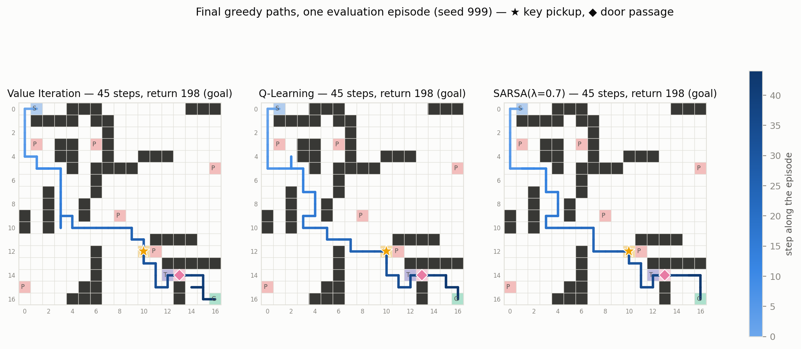

The final-path figure is the on-policy complement to the disagreement
maps: one greedy evaluation episode per algorithm, all under the same
seed-999 slip stream, so any difference between panels is a policy
difference, not luck. The bottom line is identical across all three —
45 steps, return 198, decomposing as +250 (key + goal) − 45 step costs
− 5 for one slip-induced wall bump − 2 for one closed-gate wait — yet the
routes are not: Q-Learning cuts through the interior corridors around
rows 5–9 while VI and SARSA(0.7) hug the west edge down to row 10. That
is the near-tie analysis made visible — different greedy choices in
equally-priced corridors produce different paths of exactly equal value,
which is why ~51% raw agreement coexists with matching returns. In fact,
replaying each policy's *intended* actions with slips disabled walks
exactly 33 moves for all three agents — the BFS lower bound for the
start→key→goal mission — so the ~10 extra realized moves are entirely the
price of the 20% slip rate, not routing waste. The short
dead-end spurs (Q-Learning near (4,2), VI just south-west of the goal) are
perpendicular slips followed by an immediate correction — the 0.8/0.1/0.1
dynamics in action. And every route funnels through ★ → gate → ◆: each
agent pays exactly one −2 gate wait, confirming that the bottleneck cannot
be planned away entirely, only phase-timed. The limitation is inherent:
this is a single episode at a single seed — representative (45 steps sits
within the 43.4–45.6 eval-mean band of the table above), but the aggregate
table, not this picture, carries the comparison.

**Three sample states**
([comparison_sample_states.csv](results/raw_data/comparison/comparison_sample_states.csv)),
chosen by distinct mechanisms:

1. **Penalty-adjacent, (2,1), k=0, phase 4 — 669 visits.** VI: right;
   SARSA: left (gap 3.13). The cell adjoins penalty (3,1); SARSA learned
   the detour that keeps slip-risk away from the −10 pit. This is the
   on-policy safety margin, quantified: its own exploratory slips into the
   pit during training are priced into its Q-values.
2. **Chamber near-tie, (15,15), k=1, phase 1 — 1418 visits.** VI: down;
   Q-Learning: right; gap **exactly 0.000**. Two symmetric two-step routes
   to the goal — the "disagreement" is a tie-break formality.
3. **On the gate, (14,12), k=1, phase 0 — 5 visits.** VI: right (the door
   is one step away); Q-Learning: down; gap 19.7. Agents pass *through*
   the gate but almost never stand on it, so with five visits the estimate
   never learned the doorway. Large errors live where data is scarce.

---

## 7. Transfer learning (Q-Learning)

### 7.1 Target environments

Both targets derive deterministically from the source
(`perturb_map`, BFS-validated, chamber/door/gate/start untouched; walls are
*moved*, preserving the wall-count constraint):

| | similar target | different target |
|---|---|---|
| walls moved | 11/56 = **19.6%** (spec 15–20%) | 20/56 = **35.7%** (spec ≥ 35%) |
| key | unchanged (12,10) | **relocated to (5,15)** |
| penalty cells | unchanged (6) | **+3 → 9** |

In the different target the old key location becomes a plain corridor — a
built-in negative-transfer trap for any policy trained on the source — and
the new key again sits beside a penalty cell, recreating the risky-pickup
motif in new terrain.

### 7.2 Scenarios and results

Four spec scenarios — scratch (zero Q, baseline), full transfer, scaled
transfer Q₀ = β·Q_source with β ∈ {0.25, 0.5, 0.75}, and selective transfer
(only states whose 3×3 neighborhood is unchanged between maps: 1356 of 2724
source states for the similar target, 672 for the different one). All
scenarios share 5000 episodes, ε 0.3→0.05, 3 seeds. Jumpstart is measured
as greedy evaluation of the initial table *before* any training (200
episodes) — note that scratch is not handicapped by the low ε start,
because a zero-initialized Q with random tie-breaking explores like ε≈1
anyway. Target optima (VI): similar 192.5, different 179.8.

| target | scenario | jumpstart (success / return) | episodes to 90% | final return |
|---|---|---|---|---|
| similar | scratch | 0% / −3670 | 718 | 181.8 |
| similar | full | **100% / −139** | **99** | 185.2 |
| similar | scaled β=0.25 | 100% / −139 | **99** | **190.2** |
| similar | scaled β=0.50 | 100% / −139 | **99** | 189.3 |
| similar | scaled β=0.75 | 100% / −139 | **99** | 185.7 |
| similar | selective | 0% / −2777 | 132 | 186.1 |
| different | scratch | 0% / −3634 | 849 | 164.6 |
| different | full | **0% / −3573** | 691 | 164.0 |
| different | scaled β=0.25 | 0% / −3573 | 500 | 166.4 |
| different | scaled β=0.50 | 0% / −3573 | **478** | 165.2 |
| different | scaled β=0.75 | 0% / −3573 | 622 | 165.1 |
| different | selective | 0% / −3539 | 519 | 163.8 |

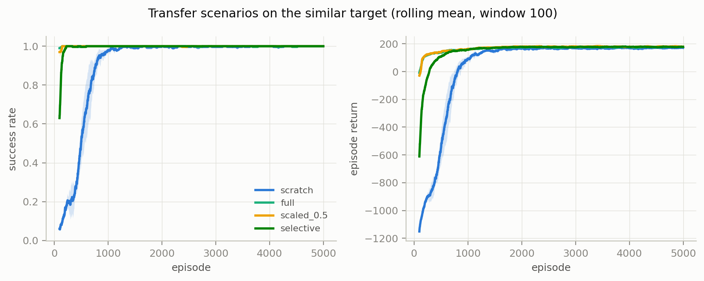

On the similar target transfer is unambiguously positive: the transferred
tables succeed in 100% of pre-training greedy episodes (slowly — detouring
around the 11 moved walls explains the −139 return) and sustain 90% success
from the first measurable window (episode 99), ~7× sooner than scratch
(718). Selective transfer, despite failing its jumpstart evaluation (its
partial table has holes exactly where the maps changed), recovers almost
the entire speed advantage (132) — the transferred half of the state space
is the half that still matters.

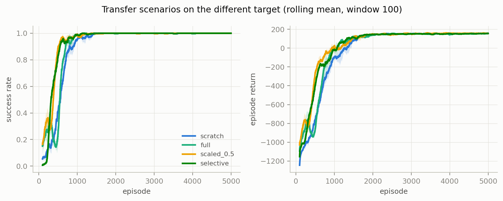

On the different target transfer is no free lunch: the full-transfer
jumpstart is 0% success, barely above scratch — the inherited policy
marches confidently to where the key *used to be*. Learning speed still
improves modestly (691 vs 849 episodes) because the with-key half of the
table and the unchanged corridors remain useful. The full-transfer curve
visibly lags even scratch around episodes 200–400 before recovering: the
population-level signature of negative transfer being unlearned.

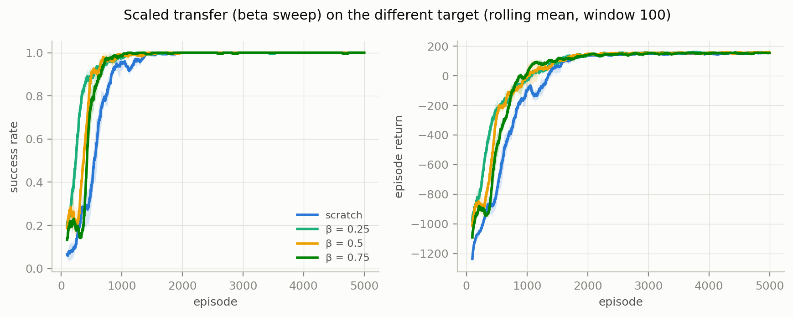

The β sweep isolates *transfer intensity*. Two clean facts: first,
**β does not change the jumpstart** — argmax is scale-invariant, so every
β > 0 shares the identical initial greedy policy (identical −3573 in the
data); β acts only through update dynamics, where smaller β is a weaker
prior that TD updates overwrite faster. That is why β is monotone in
adaptation speed here (500 / 478 / 622 episodes for 0.25 / 0.5 / 0.75) and
why β=0.25 achieves the best *final* return on the similar target (190.2 vs
full's 185.2 — full-strength stale magnitudes linger). Second, with the
5000-episode budget every scenario on the different target converges to the
same **tabular asymptote** (164–166 vs the 179.8 optimum, ~64 steps vs 50.2
optimal — the familiar ε-floor/fixed-α gap, not a transfer effect):
transfer decides how *fast* the asymptote is reached (up to −44% episodes),
never where it lies.

### 7.3 A negative-transfer case, end to end

Required by the spec: state **(12,12), k=0, phase 0** — two cells from the
old key, directly behind penalty cell (12,11). From
[transfer_negative_case.csv](results/raw_data/transfer/transfer_negative_case.csv)
(full-transfer run on the different target, Q(s) snapshots during
training):

| episode | Q(up) | Q(down) | Q(left) | Q(right) | greedy |
|---|---|---|---|---|---|
| 0 (transferred) | −3.34 | −2.14 | **−1.14** | −1.73 | **left** |
| 100 | −3.10 | −1.20 | **+13.46** | −1.73 | **left** |
| 500 | −3.52 | −2.99 | −4.04 | **−2.93** | **right** |
| 2500 | −3.92 | −4.03 | −4.90 | −3.92 | up (stale tie) |
| target optimal (Q*) | 32.68 | 27.49 | 20.36 | **34.63** | **right** |

The arc has four acts. (1) The transferred greedy action walks **left,
into the penalty cell, toward a key that no longer exists** — the
target-optimal action is right, with an action gap of 14.3. (2) By episode
100 the error has *grown*: bootstrapping from neighboring values that are
still transfer-optimistic briefly amplifies q_left to +13.5 — negative
transfer can compound before it corrects. (3) By episode 500 reality has
extinguished it: q_left collapses and the greedy action flips to the
target-optimal right. (4) Thereafter the converging policy stops visiting
the state entirely; its values flatten into a stale near-tie. The
correction happens exactly while the state still matters — then the state
is abandoned.

---

## 8. The GUI — MazeMario

`python main.py` launches a retro game-style Tkinter visualization
([gui/](gui/), six modules; no threads — a cooperative `after()` loop
drives environment steps, animations and the HUD). Every element is
diegetic: brick walls, thorn-ringed pits the hero falls into (with a rising
red −10), a bobbing sparkling key, a wooden door that slides open, a
princess at the goal — and **the periodic gate is a dragon that rises from
its den on closed phases and retreats on open ones**, with a HUD countdown
(IN·n / OUT·n), making the chosen dynamic feature the most visually
prominent object in the game.

| spec control | GUI element |
|---|---|
| algorithm + source/target environment selection | HERO BRAIN + SELECT WORLD menus |
| training vs evaluation mode | MODE: TRAIN / WATCH |
| start / stop / resume / reset / re-run | START, PLAY/PAUSE, RESTART (+ single-STEP) |
| animation speed | 0.5–4× slider (≥2× fast-forwards training, ~60+ episodes/s) |
| policy display toggle | POLICY overlay — greedy arrows for the agent's *current* key status and gate phase, updating live during training |
| live info: episode, steps, reward, ε, key, recent success rate | HUD: EP · STEPS n/cap · SCORE · ε · KEY · WIN (last 100) |

WATCH mode replays trained policies (VI is solved live for the selected
world; the Q-Learning / SARSA tables load from `results/models/`); TRAIN
mode runs a fresh learner with the config's ε schedule and freezes at the
5000-episode budget (ε shows DONE), after which the hero plays its learned
table greedily. Selecting the source-trained Q-table on the *different*
world shows §7.3's negative transfer live: the hero marches toward the
removed key. A TRAIN session observed in the GUI (56% win rate around
episode ~880, 89% by ~1100) matches the headless learning curves of §4 —
the game is the same environment and the same update rules, animated.

---

## 9. Comparison summary

| criterion | Value Iteration | Q-Learning | SARSA(λ=0.7) |
|---|---|---|---|
| needs | full model P, R | env interaction only | env interaction only |
| unit of progress | Bellman sweep | episode | episode |
| output | V*, π* | Q, π | Q, E, π |
| compute for this task | ~0.1 s | ~8 s | ~54 s |
| samples for this task | 0 | ~850k steps | ~770k steps |
| optimality reached | exact (proof by contraction) | ~95–99% of V*, asymptote set by ε-floor and fixed α | same class, slightly better here (V^π 7.83 vs 5.93) |
| behavior near danger | risk-neutral optimal | risk-neutral estimates | measurably safer routes (on-policy) |
| sensitivity studied | γ (§3) | ε schedule, reward shaping (§4) | λ (§5) |

---

## 10. Answers to the analytical questions

**Q1 — Define the problem as a complete MDP; how does the state preserve
the Markov property?** §2.2 gives S, A, P, R, γ, terminals and policy. The
state (r, c, has_key, gate_phase) contains every variable that affects the
future: door passability follows from `has_key`, gate passability from
`gate_phase`, so P(s′|s,a) needs no history. Dropping the phase makes the
same (x,y,k) behave differently depending on arrival time — the concrete
Markov violation our feature choice was designed to expose.

**Q2 — on-policy vs off-policy near dangerous cells.** Q-Learning's
off-policy max-target learns values of the *greedy* policy while behaving
exploratorily; SARSA's on-policy target prices its own ε-greedy slips into
Q. The measured consequence (§6): SARSA enters penalty cells least in
greedy evaluation (0.188/ep vs Q-Learning 0.236, VI 0.260) and its
penalty-adjacent deviations from VI are *systematic* (agreement 63.7% vs
Q-Learning's 67.3%, both far above their ~51% global agreement — gaps near
danger are sharp, not ties). Sample state 1 in §6 is the concrete exhibit:
SARSA prefers a detour worth −3.13 in Q* because it keeps slip-risk away
from a pit.

**Q3 — why does VI need the transition model while the others learn
without it?** VI's backup averages over P(s′|s,a) explicitly — it *is* a
computation on the model (here exposed exactly by `transitions()`, §2.2).
The TD methods replace that expectation with sampled transitions: each
`step()` outcome is an unbiased draw from the same distribution. The trade
in this project, measured: with the model, exact optimality in ~0.1 s and
zero samples; without it, ~500–600k environment steps to near-optimal
(§6). Advantage of model-free: it works when the model is unavailable or
unwritable; limitation: sample cost and residual suboptimality concentrated
where experience is scarce. Advantage of model-based: exactness and speed;
limitation: it needs precisely the object that real problems rarely give
you (and our exact model made VI usable as ground truth for grading the
others).

**Q4 — which λ balances learning speed and stability best?** λ = 0.7
(§5.1): 982 episodes to sustained success (vs 1670 at λ=0, 805 at λ=0.9),
the lowest and most consistent late-training variance (16.5–24.4 return
std vs up to 72 at λ=0 and 31.6 at λ=0.9) and the best final returns
(189.5–190.8). λ=0.9 is faster to the 90% mark but noisier at convergence
because long traces propagate exploratory-slip deltas backward.

**Q5 — three states where the model-free policy differs from VI, with
local analysis.** §6: (2,1) — a systematic on-policy safety detour beside a
pit (gap 3.13, 669 visits); (15,15) — an exact near-tie between two
symmetric routes to the goal (gap 0.000, 1418 visits); (14,12) — a genuine
error on the gate cell itself (gap 19.7) preserved by data scarcity
(5 visits). Together they show disagreement has three different causes —
risk shaping, tie-breaking, and missing data — and only the third is a
real deficiency.

**Q6 — similar vs different target in transfer.** §7.2: on the similar
target, transferred tables jumpstart at 100% success and cut
episodes-to-90% by ~7× (99 vs 718); on the different target the jumpstart
is 0% (the policy heads to the removed key), learning speed still improves
(691 vs 849 full; 478 at β=0.5, −44%), and negative transfer appears —
concretely reconstructed in §7.3 with Q-value snapshots through its rise,
correction and abandonment. With a converged budget, *final* performance
is scenario-independent (the tabular asymptote); transfer moves only the
speed of getting there. β never changes the initial greedy policy (argmax
scale-invariance) — it tunes how strongly the prior resists correction,
which helps on the similar target (β=0.25 final 190.2) and must be
moderate on the different one (β=0.5 fastest).

---

## 11. Limitations and design corrections

**Limitations.**
- Tabular methods with fixed α and an ε floor converge to an asymptote
  measurably below V* (§6, §7.2); closing that gap would need α decay and
  sustained exploration, at much higher sample cost.
- Raw policy-agreement percentages are a weak quality metric in this
  environment (41% of states have near-tied actions); we therefore always
  paired them with exact policy evaluation V^π and action-gap analysis.
- Wall-clock timings vary with machine load between runs (ratios are
  stable and are what we interpret).
- The transfer study follows the spec in using Q-Learning only; whether
  SARSA's safer policies transfer differently is untested here.

**Design corrections made during development** (kept as evidence of
requirement-driven iteration):
- **Gate placement:** first draft put the gate on one shortest key→door
  path; an equal-length detour bypassed it, so the optimal policy could
  ignore the feature. Moved to the chamber-entrance bottleneck; §3's
  phase-dependent policy validates the fix.
- **Shaping unit test:** the first version assumed each s′ occurs once per
  (s,a); in fact the same s′ can occur with different rewards (wall −5 vs
  gate bump −2, both staying in place). Rewritten to compare full outcome
  distributions.
- **door_pass reward:** initially +20 per passage — farmable (+18 net per
  back-and-forth loop through the open door). Set to 0; the event is still
  logged.

## 12. Reproducibility

All maps, models, CSVs and figures regenerate from the committed code and
config: see [README — Reproducing the results](README.md#reproducing-the-results).
The final artifact set in this repository was produced by deleting
`results/` entirely and re-running the pipeline; map generation and every
training run are seeded (training seeds {7, 21, 42}, evaluation seed 999),
and the regenerated VI, Q-Learning, SARSA and comparison outputs matched
the previous run line-for-line (up to the wall-clock runtime fields, which
track machine load). Unit tests: `python -m pytest tests/`
(58 tests).
