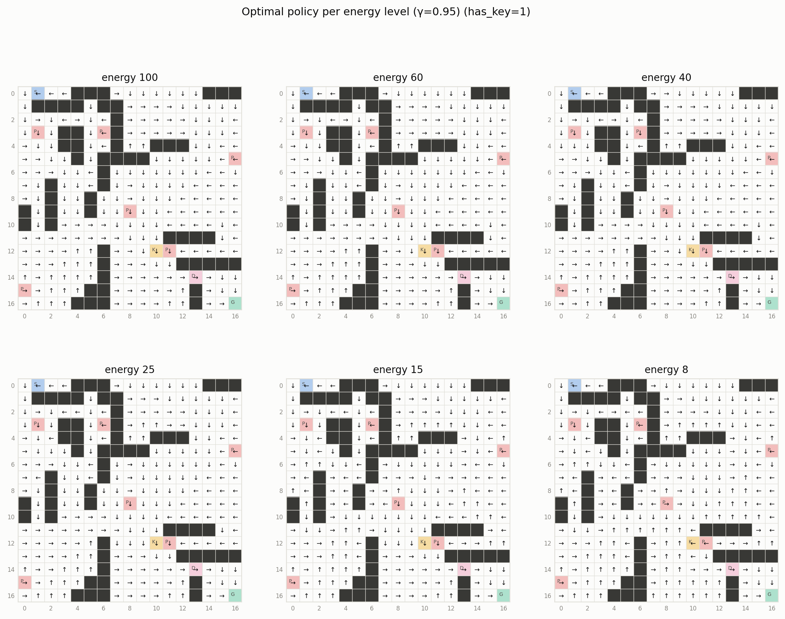
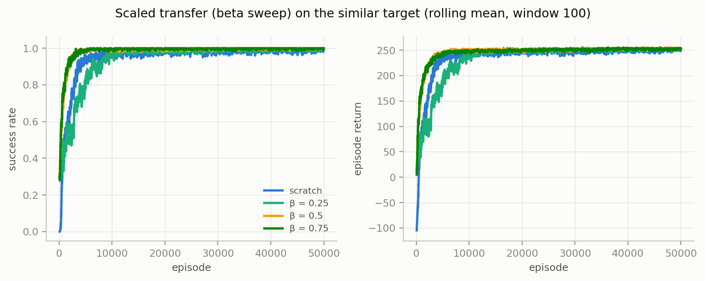

# Design and Analysis of an Intelligent Agent in a Dynamic Maze

**Reinforcement Learning — Final Project · Student ID 40424624**

This report presents the design, implementation and analysis of a dynamic
maze environment modeled as a Markov Decision Process, solved and studied
with three algorithms — Value Iteration, Q-Learning and SARSA(λ) — followed
by a transfer-learning study and an interactive game-style GUI. Every number
below is generated by committed code from committed configuration
([experiments/configs/default.json](experiments/configs/default.json)) and
raw data ([results/raw_data/](results/raw_data/)); the
[README](README.md#reproducing-the-results) gives the exact commands that
reproduce the full artifact set.

---

## 1. Problem setup

Per the specification, the base seed and maze size derive from the student
ID:

```python
student_id = "40424624"
base_seed  = int(student_id[-2])   # = 2
maze_size  = 15 + (base_seed % 4)  # = 17  →  17×17
```

**Chosen dynamic feature: limited energy (انرژی محدود).** The agent starts
each episode with a budget of 100 energy units. Every step burns one unit —
bumps and blocked moves included, a wasted step still burns fuel — and
entering a penalty cell drains 5 extra. At zero the episode terminates as a
**death** with an additional −50 penalty; reaching the goal on the last
unit still counts as a win. The remaining budget is part of the observable
state.

This design revises the argument made when this project's gate-based
variants were built (the `main` and `future_phase` branches dismissed
limited energy as "duplicating the required step cap" at a ×100 state
cost). Having now built it, that dismissal was wrong on two counts. First,
the step cap and the energy budget are categorically different objects:
the cap *truncates* an episode (a bookkeeping device outside the
stationary MDP, invisible to Value Iteration), while energy exhaustion
*terminates* the MDP with a real penalty — it changes the value function,
the terminal set and the bootstrap semantics. Second, because the budget
is observable state, the optimal policy can *condition on it*: the same
cell with the same key status warrants different actions at different
remaining budgets (§3 exhibits this desperation band). What the old
argument got right is the price: the state space grows ×101, and §§4–7
measure exactly what that costs tabular learning — which turned out to be
the most instructive phenomenon of the branch (§13).

## 2. Environment design

### 2.1 Map generation and validation

The maps are **byte-identical to the gate branches** — the generator, the
committed [source map](environments/maps/source.json) and both transfer
targets are untouched, which keeps the three designs comparable (§13). The
map is generated reproducibly from seed 2
([environments/generator.py](environments/generator.py)): 56/289 cells are
walls (**19.4%**, spec ≥ 15%) and **6 penalty cells** (spec ≥ 5) at (3,1),
(3,6), (5,16), (9,8), (12,11), (15,0). Start (0,1), key (12,10), door
(14,13), goal (16,16):

```
.S..###.......###        S start   K key    D locked door
.####.##.........        G goal    P penalty (pit)
.......#.........        # wall    . floor
.P.##.P#.........
...##..#..###....
....#.####......P
......#..........
..#...#..........
..#..#...........
#.#..#..P........
#.#..............
...........####..
......#...KP.....
......#.....#####
......#......D...
P....##......#...
....###......#..G
```

(The map file's gate cell in front of the door is plain floor under the
energy dynamics; the environment ignores its marker.) The goal sits in a
walled chamber whose only entrance is the locked door, so the mission
order start → key → door → goal is enforced by geometry rather than reward
design. Validity is checked with deterministic BFS (start→key with the
door closed, key→goal with it open); seed 2 succeeds at attempt 0 and the
generator reproduces all three committed maps byte-for-byte.

### 2.2 MDP formalization

| element | definition |
|---|---|
| State space S | `s = (r, c, has_key, energy)`: 233 passable cells × 2 × 101 energy levels = **47,066 states** |
| Action space A | up, down, left, right (4) |
| Transition P | intended direction with p = 0.8, each perpendicular with p = 0.1; the move is resolved against walls and the locked door (blocked without the key; blocked outcomes stay in place); every resolved step decrements energy by 1, a penalty entry by 1+5; entering the key cell sets `has_key = 1` |
| Reward R | §2.3 — sparse and potential-shaped variants, plus the death penalty |
| Discount γ | 0.95 reference; {0.90, 0.95, 0.99} studied in §3 |
| Terminal states | goal cell (success, any energy) **and every state with energy 0 (death)** |
| Episode cap | 3 × 233 = 699 steps (kept for spec compliance; it can never bind — energy exhausts after at most 100 steps, so the `timeout` event never fires) |
| Policy | π(s) → A; deterministic greedy policies are compared across algorithms |

**Markov property.** The spec's minimal state `(x, y, k)` is extended by
exactly the variable the chosen feature requires. Door passability is a
function of `has_key`; survival is a function of `energy`; with both in
the state, P(s′|s, a) is well defined with no reference to history.
Without `energy`, the *same* (x, y, k) would sometimes terminate fatally
and sometimes not, depending on how many steps the agent had already
spent — a Markov violation, and Value Iteration could not even write down
its model. This answers analytical question 1 (§10, Q1).

**Termination vs truncation.** Reaching the goal or dying *terminates*
the MDP; the step cap would merely *truncate*. The learning agents'
bootstrap term is zeroed only on true termination — death included, which
is what makes the −50 propagate correctly ( `environments/maze.py`
returns separate `terminated`/`truncated` flags, and a unit test pins the
death-transition bootstrap to zero).

**Choosing the starting budget.** E0 is the design's central knob, and it
was set empirically from both directions. The deterministic minimum
mission is 33 steps (23 start→key + 10 key→goal), but under 0.8/0.1/0.1
slips each step advances the mission only ~80% of the time, so optimal
play needs 33/0.8 ≈ 41.3 steps in expectation (measured: 41.9). The
budget must cover that mean, its right tail, and the imperfection of
*learned* policies:

| E0 | optimal-play success (VI, 500–2000 episodes) | note |
|---|---|---|
| 33 (= minimum) | 0.65% | task unwinnable; V*(start) = −22 |
| 40 | 34.8% | |
| 45 | 70.5% | |
| 50 | 89.4% | |
| 57 | 98.8% | knife-edge: optimal play survives, **nothing tabular can learn** (§4 note) |
| 60 | 99.6% | |
| 70+ | 100% | learnability knee ≈ 1.9 × a map's optimal mission length |

At E0 = 57 the *learners* cap out near 84% evaluation success however
long they train, because every extra step a near-optimal policy takes
converts directly into deaths. The knee where tabular learning converges
sits near 1.9× a map's optimal mission — and the binding map is not the
source but the **different transfer target** (optimal mission 48.5 steps,
§7), which fixes **E0 = 100** (2.06× the hardest mission, 2.4× the
source's). The full tuning study is recorded in the config comment.

The environment exposes its exact model via `transitions(s, a)` — built
from the *same* resolution code that `step()` samples from, so the model
consumed by Value Iteration and the simulation experienced by the
learners can never diverge. Every step reports its named events (move,
wall hit, penalty entry, key pickup, locked-door attempt, door passage,
goal, timeout — the spec's minimum loggable set — plus `energy_out` for
our feature), reaching the logs as per-episode counts (`wall_hits`,
`penalty_entries`, `energy_left`, `death`, `locked_door_attempts`,
`door_passes`, `key_picked`, `success`, `timeout`) and as named events on
every row of the per-step update-trace logs (§4, §5.2).

### 2.3 Reward design (two variants)

**Sparse** (the evaluation standard): step −1, wall hit −5, penalty cell
−10, locked-door attempt −2, key pickup **+50**, goal **+200**, door pass
0, **death −50**. The death penalty is deliberately larger than any
plausible continued struggle (at most ~50 remaining step costs), so
"give up early" is never optimal — the agent always prefers fighting for
the goal. The door-pass bonus is zero *on purpose*: any repeatable
positive bonus on a non-terminal cell can be farmed by stepping back and
forth through it. There is **no reward for leftover energy**: frugality
is priced entirely through the step cost (1 energy = 1 reward for plain
moves) and through the terminal structure — wasting a step lowers the
probability of collecting the +200 before exhaustion. §3 shows the
consequence: energy beyond what optimal play needs has zero marginal
value (V*(start) is identical at E0 = 80 and 100).

**Shaped**: sparse plus potential-based shaping F = γΦ(s′) − Φ(s) with
Φ(s) = −(remaining BFS mission distance), continuous at the key pickup,
and — the rule the energy design adds — **Φ = 0 at every terminal state,
death included**. With that rule the telescoped shaping sum gives every
trajectory the same −Φ(s₀) offset regardless of where it ends, so the Ng
et al. (1999) policy-invariance guarantee survives the enlarged terminal
set. As a numerical check, on the 33-step deterministic optimal walk
(unchanged from the gate branches) the shaped return exceeds the sparse
return by exactly the telescoped potential sum, 59.4. Note that Φ is
deliberately **energy-blind**: shaping accelerates *navigation*, while
the budget semantics must still be learned from the death terminal — §4
measures how much that matters.

### 2.4 Verification

67 unit tests ([tests/](tests/)) pin the environment down: transition
probabilities sum to 1 for all 47,066 × 4 state-action pairs; sampled
steps always lie in the support of the exposed model; empirical action
noise is 0.8/0.1/0.1; every dynamics rule has its own test — including
the energy rules: per-step drain (bumps included), the extra pit drain
with clamping at zero, death as a terminal with its reward, goal-on-the-
last-unit precedence, dead states having no outgoing transitions, and a
Q-Learning backup on a real death transition bootstrapping exactly zero;
the shaping is proven potential-based under the terminal-Φ rule; the
generator yields valid maps for all ten base seeds; and the learning
updates and transfer-table constructions are tested as before.

---

## 3. Value Iteration

Implemented from scratch (`agents/value_iteration.py`) as Bellman
optimality backups over the exact model, with convergence declared when
max<sub>s</sub> |V<sub>k+1</sub>(s) − V<sub>k</sub>(s)| < 10⁻⁶. The
padded-array backup handles the ×17 state count without changes
(building the 47,066-state model takes ~2 s, solving ~1–3 s per γ).

| γ | sweeps to converge | V(start) | eval success | eval death | eval return | eval steps | policy agreement vs γ=0.95 |
|---|---|---|---|---|---|---|---|
| 0.90 | 74 | −9.38 | 100% | 0% | 194.1 | 41.9 | 98.6% |
| 0.95 | 82 | 11.66 | 100% | 0% | 194.1 | 41.9 | — (reference) |
| 0.99 | 90 | 123.13 | 100% | 0% | 195.1 | 42.2 | 96.2% |

(Evaluation protocol here and throughout: 500 greedy episodes on the
stochastic environment, evaluation seed 999.)


Convergence is now **horizon-bound rather than discount-bound**. On the
gate branches, sweeps-to-threshold grew markedly with γ (80 → 91 → 102)
because the contraction rate ln γ dominated. Under energy the MDP is a
directed acyclic graph in the energy coordinate — every transition strictly
decreases it — so value information provably stops propagating after ~E0
sweeps, and all three γ values converge within 74–90 sweeps of each
other. The budget acts as a hard planning horizon built into the state
space, which is also why V(start) spans −9.4 to +123.1 across γ while
all three policies are behaviorally near-identical (agreement ≥ 96%):
value *scale* says nothing about policy *quality*.


The value function (max over non-exhausted energy levels) shows the
mission structure directly: without the key (left), value climbs toward
the key cell; with it (right), the gradient re-orients toward the
chamber. The k=0 panel is darker mid-map than k=1 because keyless states
still have the one-time +50 pickup ahead of them. Optimal play banks
fuel: evaluation episodes finish with a mean of 56.8 of 100 units left —
and that surplus is worthless by design (§2.3): re-solving at E0 = 80
gives the identical V*(start) = 11.66, because optimal play never
touches the extra 20 units.



This figure is the central evidence that the energy budget genuinely
shapes decision-making — the same role the phase grid played for the
gate. Each panel is the greedy policy (with key) at one remaining budget.
At high energy the panels are indistinguishable: an agent with fuel to
spare plans by reward alone. Below ~e = 15 the arrows visibly reorganize
around every pit. Two concrete exhibits, readable off the panels:

- **Cell (12,12), key in hand, beside pit (12,11):** at e ≥ 15 the
  optimal action is *left* — walking the corridor past the pit toward the
  door (V = 81.8 at e = 100). At e ≤ 12 it flips to *right*, away from
  the pit (V = −41.4 at e = 12): with the budget nearly gone, a 10%
  slip into the pit costs 6 units ≈ certain death, and the detour is
  suddenly worth it.
- **Cell (4,16), no key, beside pit (5,16):** *left* for all e ≥ 15,
  flipping to *up* at e ≤ 12, with V collapsing from +45.0 (e = 100)
  through −7.6 (e = 25) to −44.6 (e = 6) — the "death shadow": at low
  energy a keyless agent this far from the mission cannot finish at all,
  and the optimal policy switches from racing the mission to cheaply
  avoiding hazards while the clock runs out.

One planned phenomenon did *not* materialize, and the reason is
instructive: we expected "desperation shortcuts" — low-energy agents
cutting *through* pits to save steps. Measuring the map shows why they
cannot exist: on this seed, the pit-free shortest paths for both mission
legs are exactly as long as the through-pit paths (0 steps saved), so a
pit is never a shortcut, only a hazard. The desperation phenomenon is
therefore *inverted* — caution when poor, boldness when rich — and it is
a genuine function of the budget, not of position: no reward parameter
changes with e, only the survival odds do.

---

## 4. Q-Learning

Off-policy tabular TD control (`agents/q_learning.py`) with ε-greedy
behavior, randomized greedy tie-breaking, bootstrap zeroed only on true
termination (death included), and per-state visit counts saved with the
table. Hyper-parameters (config): α = 0.1, γ = 0.95, ε: 1.0 → 0.05 over
12,000 episodes, 15,000 episodes, seeds {7, 21, 42}.

**The headline result of this section: sparse one-step Q-Learning cannot
learn this task at all.** All six sparse runs end with ~1% training
success and 1–2% evaluation success (mean return −162 to −170,
essentially every episode a death) after 15,000 episodes — and control
experiments up to 40,000 episodes show the same flat line. The failure is
structural, not budgetary. Three mechanisms compound:

1. **Exploration cannot reach the goal.** A random walk under a 100-step
   life almost never completes the 42-step two-leg mission, so the +200
   is effectively never observed (first successes arrive after ~5,600
   episodes, and remain isolated).
2. **The energy dimension fragments the table.** Each cell must be
   learned separately at every arrival budget; a success at
   (cell, e = 61) teaches nothing about (cell, e = 58), so the visits
   that main's 2,796-state table concentrated are spread over ~20,000
   states here.
3. **One-step backups cannot chain rare successes.** A lone success
   updates only the final pre-goal state; the next success arrives at a
   different energy layer and fails to reuse it. (SARSA's traces repair
   exactly this — §5.)

The canonical Q-Learning agent is therefore the **shaped/exponential**
run: the potential gradient makes every step informative, and learning
ignites reliably. By Ng-invariance (§2.3) its greedy policy is directly
comparable to sparse Value Iteration, and all evaluations run on the
sparse environment.

**Hand-reconstructed update** (required by the spec; from the committed
[q_update_trace.csv](results/raw_data/q_learning/q_update_trace.csv),
episode 7,500, α = 0.1, γ = 0.95): at s = (0,1, k=0, e=100), action left,
s′ = (0,0, k=0, e=99). The logged reward is +1.6 — itself reconstructable
as the step cost plus shaping, −1 + [0.95·Φ(s′) − Φ(s)] =
−1 + [0.95·(−32) − (−33)] = +1.6:

```
target   = r + γ·max Q(s′,·) = 1.6 + 0.95·6.195884 = 7.486090
TD error = target − Q(s,a)   = 7.486090 − 5.847821 = 1.638269
Q(s,a)  ← 5.847821 + 0.1 · 1.638269 = 6.011648  ✓ (matches the log)
```

### 4.1 ε-decay schedules (shaped reward)

| run (3 seeds each, seed means) | first success | episodes to 90% success | eval success / death | eval return | VI policy agreement |
|---|---|---|---|---|---|
| shaped / exponential | ep 1,952 | **5,639** | 99.9% / 0.1% | 167.2 | 57.4% |
| shaped / linear | ep 4,293 | 9,853 | 99.7% / 0.3% | 163.5 | 58.7% |


Exponential decay reaches sustained success ~1.7× earlier, for the same
reason as on the gate branches: ε collapses early and the agent exploits
the shaping gradient sooner. The trade-off also survives: linear decay
explores longer and ends with slightly higher agreement with the optimal
policy. (The figure's sparse panels are flat near zero — the §4 failure,
plotted.)

### 4.2 Sparse vs shaped reward

| run (3 seeds each, seed means) | episodes to 90% | eval success | eval return | eval energy left |
|---|---|---|---|---|
| sparse / exponential | never | 1.5% | −169.8 | 0.1 |
| shaped / exponential | **5,639** | **99.9%** | **167.2** | 34.1 |


On the gate branches shaping was an accelerator (~3× fewer episodes to
the same asymptote). Under the energy budget it is **the difference
between learning and not learning** — the single largest effect measured
in this project. The mechanism is visible in the key-found panel: the
shaped agent's key rate saturates within ~2,000 episodes (the potential
literally points at the key), which stretches its effective horizon deep
enough for exploration to find the goal before dying; the sparse agent
never gets there. The two final policies cannot meaningfully be compared
for invariance this time (they agree on 36.6% of 15,601 jointly-visited
states, but the sparse "policy" is an artifact of never having learned);
the invariance evidence is instead §6's comparison of the shaped-trained
policy against sparse Value Iteration.


The visit map (log scale, summed over energy levels) documents where the
shaped agent's experience went — 16,542 of 47,066 states carry at least
one update. The environment-semantics artifacts persist from the gate
branches: the key cell has zero k=0 visits (entering it flips the flag —
it is never a decision state), and the chamber has zero keyless visits
(structurally unreachable). The mission corridor start → key → door is
the dark backbone in both panels.

---

## 5. SARSA(λ)

On-policy tabular control with **replacing** eligibility traces
(`agents/sarsa_lambda.py`), trace reset per episode, pruning below 10⁻⁴.
Unit tests verify λ = 0 reduces exactly to one-step SARSA and that a
step-2 TD error updates the step-1 pair by exactly α·δ·γλ. Config:
α = 0.1, γ = 0.95, ε: 1.0 → 0.05 over 12,000, **30,000 episodes** (twice
the Q-Learning budget — SARSA trains on the sparse reward, where ignition
is slower; the config comment records the reasoning), seeds {7, 21, 42}.

SARSA is this branch's second existence proof: **eligibility traces
rescue sparse learning where one-step backups fail** (§4). A single
completed episode writes the goal reward into the whole ~50-state
trajectory at geometrically decaying strength — one success seeds an
entire energy-consistent path through the layered table, which is exactly
what the fragmented state space needs.

### 5.1 λ sweep (sparse reward, seed means)

| λ | first success | episodes to 90% success | late-training return std | eval success / death | eval return | pit entries /ep |
|---|---|---|---|---|---|---|
| 0 | 7,079 | never | 145.1 | 65.5% / 34.5% | 63.8 | 0.287 |
| 0.3 | 6,219 | 19,900 | 54.8 | 98.5% / 1.5% | **158.9** | 0.232 |
| 0.7 | 5,315 | 11,263 | **44.9** | 99.2% / 0.8% | 158.1 | **0.192** |
| 0.9 | 4,923 | **9,928** | 53.5 | 99.3% / 0.7% | 147.2 | 0.380 |


The sweep is a clean dose-response in credit-assignment depth. λ = 0
(one-step, on-policy) confirms §4's diagnosis from a second angle: it
finds first successes but cannot chain them — 30,000 episodes end at
65% evaluation success with enormous seed variance (late return std 145).
Every λ > 0 converges, with speed monotone in λ (19,900 → 11,263 → 9,928
episodes to sustained 90%). But depth costs stability at the top end:
λ = 0.9's long traces propagate exploratory-slip and death deltas
backward through half the trajectory, and its final returns are the
lowest of the converged group (147.2 vs 158–159) with 2× the pit-entry
rate — under a budget, backing up death spikes deep into the past makes
the policy jumpy near hazards. **λ = 0.7 is again the best balance**:
within 13% of λ = 0.9's speed, the lowest late variance (44.9), the
best safety profile (0.192 pit entries/episode — beating even Value
Iteration's 0.268) and finals statistically tied with λ = 0.3
(analytical question 4, §10).

### 5.2 δ and E over one episode


The traced episode (29,900, λ = 0.7; raw data in
[sarsa_step_trace.csv](results/raw_data/sarsa/sarsa_step_trace.csv) and
[sarsa_trace_dump.csv](results/raw_data/sarsa/sarsa_trace_dump.csv))
happens to be a **death episode, end to end** — the single most
informative trajectory the logs could have caught. Ninety steps: a wall
bump at step 3 (δ = −6.28), the key pickup at step 43 (r = +49,
δ = +14.2 — the table had not fully priced this pickup at this energy
level), a pit slip at step 52 (r = −11, δ = −26.0, the extra drain
included), and death at step 90 with r = −51 and the episode's largest
surprise, δ = −37.2. The right panel shows the eligibilities of the
first four state-actions as parallel straight lines on the log axis —
exactly (γλ)ᵗ = 0.855ᵗ (0.855, 0.731, 0.625, 0.534, …) — so that final
death spike still reaches ~25 steps back up the trajectory with
geometrically decaying weight, teaching the whole approach that this
route, at this budget, ends badly. That is eligibility-trace credit
assignment made visible, on the branch's own signature event.

---

## 6. Three-algorithm comparison

Canonical agents on the identical map: VI (γ = 0.95, sparse model),
Q-Learning (shaped/exponential, seed 7), SARSA(λ = 0.7, sparse, seed 7);
**all evaluation on the sparse environment**, 500 episodes, seed 999.
Data:
[comparison_summary.csv](results/raw_data/comparison/comparison_summary.csv).

| metric | Value Iteration | Q-Learning (shaped) | SARSA(0.7, sparse) |
|---|---|---|---|
| type | model-based | model-free, off-policy | model-free, on-policy |
| runtime (this machine) | **4.3 s** | 26.6 s | 232.9 s |
| env samples to 90% success | — (has the model) | **526,319** | 993,447 |
| total env samples | 0 | 1,158,535 (15k eps) | 2,393,736 (30k eps) |
| model file size | 1,745 KB (V + π) | **1,392 KB** | 2,038 KB |
| eval success / death | **100% / 0%** | 99.8% / 0.2% | 99.0% / 1.0% |
| eval return / steps | **194.1 / 41.9** | 167.8 / 64.6 | 158.6 / 67.8 |
| energy left at goal | **56.8** | 33.7 | 31.1 |
| V^π(start), exact | **11.66 = V\*** | −13.44 | −13.30 |
| VI agreement (visited states) | — | 57.4% | 37.8% |
| pit entries / eval episode | 0.268 | 0.350 | **0.222** |


The gate-branch comparison story (model gets you optimality in seconds;
samples get you near-optimality slowly) survives, but the energy budget
adds a sharper second act. **Both learners succeed in ~99% of episodes
yet their exact policy values at the start state are *negative*:
V^π(start) ≈ −13.4 against V* = +11.66.** No contradiction — an
explanation. The learned policies reach the goal reliably but take ~64–68
steps against the optimum's 42; under γ = 0.95, twenty extra steps
discount the +200 by another factor of ~3 and pile up step costs, and
the slip-tail into occasional deaths does the rest. The undiscounted
evaluation return shows the same gap more gently (158–168 vs 194).
Near-success and near-optimal value are different claims, and under a
budget the difference is exactly the margin that killed learnability at
E0 = 57 (§2.2): a policy 20 steps slower than optimal is *fine* with 100
units and *dead* with 57. The learners also bank barely 60% of the
optimum's leftover fuel (31–34 vs 56.8 units).

**The near-tie effect, recomputed:** 33.9% of non-terminal states have a
second action within 0.5 of optimal under exact Q*. Raw agreement
percentages (57.4% / 37.8%) therefore stay a weak lens — SARSA's lower
agreement partly reflects that its sparse table leaves more off-path
states at stale defaults, while its on-path behavior is the safest of
the three (lowest pit rate). As on the gate branches, exact V^π and
action-gap analysis are the sharper instruments: Q-Learning's
disagreements have a median Q*-gap of 1.65 (29% below 0.5 — ties), and
its penalty-adjacent agreement (60.6%) sits above its global agreement.


The agreement maps (share of energy levels agreeing with VI, per cell)
make the visit-density story spatial: blue hugs the mission corridors
where experience concentrated; red scatters over regions the converged
policies never enter — where the greedy action is close to arbitrary,
and harmlessly so.


One greedy evaluation episode per agent under the same seed-999 slip
stream. All three finish; the learners' paths are visibly more
meandering (the ~20-step inefficiency of the table above, drawn on the
map), and each panel's title now carries the outcome vocabulary of this
branch — goal, energy out, timeout.

**Three sample disagreement states**
([comparison_sample_states.csv](results/raw_data/comparison/comparison_sample_states.csv)),
chosen by distinct mechanisms:

1. **Pit-adjacent, on the key cell — (12,10), k=1, e=57; 3,303 visits.**
   VI: down; SARSA: left (Q*-gap 10.26). Freshly keyed, the optimal move
   heads for the door past pit (12,11); SARSA prefers the detour that
   keeps slip-risk away from the pit — the on-policy safety margin,
   priced by its own training slips.
2. **Chamber near-tie — (15,15), k=1, e=38; 811 visits.** VI: down;
   Q-Learning: right; gap **exactly 0.000**. Two symmetric two-step
   routes to the goal; the disagreement is a tie-break formality.
3. **Desperation band — (12,9), k=0, e=14; 23 visits.** VI: right;
   Q-Learning: left; gap **46.8** — the largest of the three by far. At
   14 units without the key the optimal policy makes a precise dash for
   the pickup; the learner, with 23 lifetime visits to this state,
   guesses. Large errors live where data is scarce, and the energy
   dimension mass-produces scarce states: the low-energy band is visited
   only by dying trajectories, so it is learned worst exactly where
   decisions are most delicate.

---

## 7. Transfer learning (Q-Learning)

### 7.1 Target environments and method

Both targets derive deterministically from the source (BFS-validated,
byte-identical to the gate branches): the **similar** target moves 11/56
walls (19.6%, spec 15–20%); the **different** target moves 20/56 (35.7%,
spec ≥ 35%), relocates the key to (5,15) and adds 3 penalty cells. The
different target's optimal mission is longer — 48.5 steps vs the
source's 41.9 (VI eval; optimum return 183.0 vs 194.6) — which under a
budget makes it the *hardest map in the project* and the one that fixed
E0 = 100 (§2.2).

Two method notes specific to this branch, both forced by measurement:

- **Potential re-basing.** The source table is the shaped canonical
  agent's (§4), and a converged shaped table equals Q_sparse − Φ(s).
  Transferring it raw onto a map with a different potential (the key
  moved, so Φ differs everywhere keyless) plants an action-independent
  per-state bias that bootstrapping amplifies into phantom TD errors.
  Every transferred table is therefore de-shaped with the source
  potential and re-based into the target's
  (Q₀ = Q_transferred + Φ_source − Φ_target) — the same Ng-invariance
  algebra as §2.3, applied across maps. Greedy actions (hence
  jumpstarts) are unaffected; bootstrapping becomes consistent.
- **ε kept at 0.3.** A control with the canonical ε 1.0 → 0.05 made
  *everything worse* on the different target (scratch fell from 58% to
  7% training success): under tight slack, high-ε dithering burns the
  budget before the shaping gradient can be followed. The gate-branch
  rationale for 0.3 (zero-init tables explore like ε = 1 anyway) turns
  out to hold for scratch — and §7.2 shows its dark counterpart for
  transferred tables. 50,000 episodes, 3 seeds, jumpstart measured as
  greedy evaluation of the initial table before any training.

### 7.2 Scenarios and results (seed means)

| target | scenario | jumpstart success / return | episodes to 90% | final eval success | final return |
|---|---|---|---|---|---|
| similar | scratch | 0% / −577 | 3,253 | 99.7% | 165.9 |
| similar | full | **61.5% / −74** | **1,254** | 100% | 168.5 |
| similar | scaled β=0.25 | 61.5% / −74 | 5,583 | 99.9% | **171.0** |
| similar | scaled β=0.50 | 61.5% / −74 | 1,520 | 100% | 170.6 |
| similar | scaled β=0.75 | 61.5% / −74 | 1,334 | 99.9% | 167.5 |
| similar | selective | 0% / −489 | 3,294 | 99.5% | 158.3 |
| different | scratch | 0% / −573 | never (86.9%) | 86.9% | 104.5 |
| different | full | 0% / −529 | **never (3.3%)** | **3.3%** | **−152.5** |
| different | scaled β=0.25 | 0% / −529 | never (1.0%) | 1.0% | −164.6 |
| different | scaled β=0.50 | 0% / −529 | never (1.5%) | 1.5% | −164.1 |
| different | scaled β=0.75 | 0% / −529 | never (2.9%) | 2.9% | −158.4 |
| different | selective | 0% / −559 | ~31,300 (2/3 seeds) | **91.9%** | **121.9** |


On the **similar target** transfer is classical and unambiguous: the
transferred greedy policy wins 61.5% of its evaluation episodes before a
single training step (return −74 reflects long detours around the eleven
moved walls), first training successes arrive at episode 2, and full
transfer sustains 90% from episode ~1,254 — 2.6× sooner than scratch.
All scenarios converge to statistically similar finals (the tabular
asymptote), so transfer buys *speed*, as on the gate branches.


The before/after view (full transfer, seed 7, per-cell max-action |ΔQ|
and the share of energy levels keeping the transferred greedy action)
stays legible under re-basing: the mission corridor keeps its greedy
actions while the re-priced detours around moved walls light up.



The β sweep's meaning changes under re-basing, and the data shows it
cleanly. Since the re-based initial value is β·Q_knowledge − Φ_target,
β scales only the *knowledge* component while the potential term — and
therefore the initial greedy policy and the jumpstart — is
β-independent (identical 61.5% / −74 for every β, argmax
scale-invariance as on the gate branches). What β now modulates is how
strongly the transferred knowledge resists early noise: adaptation speed
is *monotonically increasing* in β (5,583 / 1,520 / 1,334 / 1,254
episodes for β = 0.25 / 0.5 / 0.75 / 1) — the opposite ordering from the
gate branches, where undiluted stale magnitudes were the liability. On a
mostly-valid map, diluting good values toward the potential baseline
just slows their re-emergence.


On the **different target** this branch's headline transfer result
appears: **magnitude transfer is not merely unhelpful but catastrophic,
and no β dose softens it.** Full and every scaled variant end 50,000
episodes at 1–3% success with returns around −155 to −165 — *worse than
never having trained* — while scratch, with identical settings, climbs
to 86.9%. The mechanism is the branch's signature interaction: the
inherited keyless values confidently point into the old-key basin; under
a 100-step life the agent dies there before ε = 0.3 exploration can find
the relocated key; and the stale optimism must be unlearned separately
at *every energy layer* — 101 copies of every poisoned cell, against the
gate branches' 6 phases. On `main`, negative transfer was a transient
(unlearned by episode ~700 of 5,000). Here it is a trap that outlasts a
10× budget.

**Selective transfer is the rescue**, and the contrast is the finding:
by transferring only states whose 3×3 neighborhood is unchanged (61
cells on this target — mostly the endgame corridor and chamber), it
excludes the poisoned basin by construction, leads scratch throughout
training, reaches 90% on 2 of 3 seeds (~31,000 episodes) and posts the
best different-target finals (91.9% success, return 121.9). Under a
resource budget, *what* you transfer matters far more than *how much* —
the β sweep's question dissolves, and the selection criterion becomes
the whole game.


The ΔQ map renders the trap as geography: the k=0 panel's rewrite
epicenter is the old-key basin, and the share-kept panel shows the
transferred greedy actions surviving essentially nowhere in the keyless
half — yet the k=1 endgame corridor stays blue, which is exactly the
knowledge selective transfer chooses to keep.

### 7.3 A negative-transfer case, end to end

Required by the spec: state **(12,12), k=0, e=35** — two cells from the
old key, beside pit (12,11), inside the poisoned basin. From
[transfer_negative_case.csv](results/raw_data/transfer/transfer_negative_case.csv)
(full transfer, seed 7, Q(s) snapshots in target-shaped coordinates):

| episode | Q(up) | Q(down) | Q(left) | Q(right) | greedy |
|---|---|---|---|---|---|
| 0 (transferred) | 15.46 | **16.00** | 15.46 | 15.46 | **down** |
| 1,500 | 15.46 | 13.92 | **15.46** | 15.46 | up (stale tie) |
| 7,500 | 15.46 | 13.92 | 15.46 | 15.38 | up (stale tie) |
| 15,000 | 13.19 | **13.69** | 13.65 | 13.29 | down |
| 30,000 | 11.89 | 12.51 | 12.31 | **12.69** | right |
| 50,000 | 11.89 | **12.02** | 11.97 | 11.98 | down |
| target optimal (Q*) | 41.10 | 31.70 | 17.52 | **44.22** | **right** |

On `main`, the corresponding table told a four-act story ending in
correction: the transferred error grew, collapsed, flipped to the
target-optimal action by episode 500, and the state was abandoned. Here
the arc is flatter and darker: **the correction never comes.** For
7,500 episodes the values barely move — the dying policy rarely revisits
this exact (cell, energy) coordinate, so the stale numbers just sit
there. What follows is not learning but erosion: all four actions drift
down together (16 → 12) as occasional deaths bleed through, the greedy
choice wanders among near-ties (down → up → down → right → down), and
after 50,000 episodes the state still values its best action at 12.0
against a true 44.2. Multiply this state by every cell of the basin and
every one of its 101 energy layers, and the §7.2 catastrophe is fully
accounted for.

---

## 8. The GUI — MazeMario

`python main.py` launches a retro game-style Tkinter visualization
([gui/](gui/), six modules; no threads — a cooperative `after()` loop
drives environment steps, animations and the HUD). Every element is
diegetic: brick walls, thorn-ringed pits the hero falls into (with a
rising red −10 *and* a cyan −6 ENERGY drain popup), a bobbing sparkling
key, a wooden door that slides open, a princess at the goal — and **the
energy budget is the HUD's centerpiece: a bolt-icon bar that drains with
every step and shifts green → gold → red through the §3 desperation
bands.** Running dry plays the branch's signature animation — the hero's
spirit flickers and rises off the board under a −50 popup — followed by
an OUT OF ENERGY screen ("COLLAPSED AT STEP n").

| spec control | GUI element |
|---|---|
| algorithm + source/target environment selection | HERO BRAIN + SELECT WORLD menus |
| training vs evaluation mode | MODE: TRAIN / WATCH |
| start / stop / resume / reset / re-run | START, PLAY/PAUSE, RESTART (+ single-STEP) |
| animation speed | 0.5–4× slider (≥2× fast-forwards training, ~60+ episodes/s) |
| policy display toggle | POLICY overlay — greedy arrows for the agent's *current* key status **and remaining energy**, so the §3 desperation flips can be watched live as the bar drains |
| live info: episode, steps, reward, ε, key, energy, recent success rate | HUD: EP · STEPS · SCORE · ε · KEY · ENERGY bar · WIN (last 100) |

WATCH mode replays trained policies (VI solved live for the selected
world; the shaped Q-Learning and SARSA(0.7) tables load from
`results/models/`); TRAIN mode runs a fresh learner with the canonical
setup — shaped reward for Q-Learning, sparse for SARSA — and freezes at
the config budget, after which the hero plays greedily. Early TRAIN
episodes make the branch's exploration problem tangible: the hero dies,
episode after episode, the bar hitting red mid-maze — until the shaping
gradient (or SARSA's traces) finds the key line. Selecting the
source-trained table on World 3 shows §7.3 live: the hero marches into
the old-key basin and collapses there.

---

## 9. Comparison summary

| criterion | Value Iteration | Q-Learning (shaped) | SARSA(λ=0.7, sparse) |
|---|---|---|---|
| needs | full model P, R | env interaction + shaping potential | env interaction only |
| unit of progress | Bellman sweep | episode | episode |
| compute for this task | ~4 s | ~27 s | ~233 s |
| samples for this task | 0 | ~1.16M steps | ~2.39M steps |
| sparse-reward learnability | exact regardless | **fails** (one-step, §4) | **succeeds via traces** (§5) |
| optimality reached | exact | 99.8% success, V^π ≪ V* (slow paths) | 99.0% success, V^π ≪ V* |
| behavior near danger | risk-neutral optimal | risk-neutral estimates | measurably safest (0.192 pits/ep at λ=0.7) |
| energy left at goal | 56.8 | 33.7 | 31.1 |
| sensitivity studied | γ (§3) | ε schedule, reward shaping (§4) | λ (§5) |

---

## 10. Answers to the analytical questions

**Q1 — Define the problem as a complete MDP; how does the state preserve
the Markov property?** §2.2 gives S, A, P, R, γ, terminals and policy.
The state (r, c, has_key, energy) contains every variable that affects
the future: door passability follows from `has_key`, survival and the
death terminal from `energy`, so P(s′|s,a) needs no history. Dropping
the energy coordinate makes the same (x,y,k) sometimes fatal and
sometimes not depending on elapsed steps — the concrete Markov violation
our feature choice was designed to expose.

**Q2 — on-policy vs off-policy near dangerous cells.** Q-Learning's
off-policy max-target learns greedy values while behaving exploratorily;
SARSA's on-policy target prices its own ε-greedy slips — and now also
its own *deaths* — into Q. The measured consequence (§6): SARSA(0.7)
enters pits least in greedy evaluation (0.192/ep vs Q-Learning's 0.350
and VI's 0.268), and §6's sample state 1 shows it detouring around the
pit beside the key at a Q*-price of 10.26. The energy budget sharpens
the contrast into a sweep-level result: deeper traces (λ = 0.9) back the
death spikes up too far and *overshoot* into jumpiness (0.380 pits/ep),
so the safety optimum sits at moderate trace depth.

**Q3 — why does VI need the transition model while the others learn
without it?** VI's backup averages over P(s′|s,a) explicitly — it is a
computation on the model, exposed exactly by `transitions()` (§2.2). The
TD methods replace the expectation with sampled transitions. The trade,
measured on this branch: with the model, exact optimality in ~4 s and
zero samples; without it, 1.2–2.4M environment steps to policies that
succeed ~99% of the time yet carry negative exact start-values (§6). The
energy budget adds a caveat the gate branches could not show: when the
task's slack is tight, the model-free sample bill is not merely large
but *structural* — under sparse rewards it cannot be paid at all without
traces or shaping (§4, §5).

**Q4 — which λ balances learning speed and stability best?** λ = 0.7
(§5.1): 11,263 episodes to sustained success (vs never at λ=0, 19,900 at
λ=0.3, 9,928 at λ=0.9), the lowest late-training variance (44.9), finals
tied with λ=0.3 (158.1 vs 158.9) and the best safety profile of any
agent in the project. λ=0.9 is 13% faster to the 90% mark but pays in
final quality (147.2) and hazard exposure — under a death terminal, the
speed/stability trade-off has real stakes.

**Q5 — three states where the model-free policy differs from VI, with
local analysis.** §6: (12,10, k=1, e=57) — a systematic on-policy safety
detour on the key cell itself (gap 10.26, 3,303 visits); (15,15, k=1,
e=38) — an exact near-tie between symmetric routes (gap 0.000);
(12,9, k=0, e=14) — a desperation-band state visited 23 times in the
agent's life, where the optimal budget-aware dash is unlearnable from so
little data (gap 46.8). Disagreement has three causes — risk shaping,
tie-breaking, and data scarcity — and the energy dimension
systematically manufactures the third in exactly the states where
decisions matter most.

**Q6 — similar vs different target in transfer.** §7: on the similar
target, transferred tables jumpstart at 61.5% success and cut
episodes-to-90% by 2.6× (1,254 vs 3,253), with β acting monotonically
through knowledge strength after re-basing. On the different target,
magnitude transfer at *any* β is catastrophic (1–3% final success vs
scratch's 86.9%): the relocated key turns the inherited keyless values
into a death trap that must be unlearned once per energy layer, and
§7.3 documents a poisoned state whose correction never arrives in
50,000 episodes. Selective transfer — structure-filtered, excluding the
changed regions — is the only variant that beats scratch there (91.9%
final, 90% on 2/3 seeds). Under a resource budget, transfer's value is
decided by *what* is transferred, not how much.

---

## 11. Limitations and design corrections

**Limitations.**
- Tabular methods with fixed α and an ε floor converge to policies that
  succeed reliably but remain far from V* in exact value (§6) — the
  budget amplifies this gap because path length converts to death risk
  at tighter E0; closing it would need α decay and far more samples.
- Raw policy-agreement percentages are a weak quality metric here (33.9%
  of states have near-tied actions, and low-energy states are
  legitimately unvisited); we always pair them with exact V^π and
  action-gap analysis.
- The desperation band is exhibited by the optimal policy (§3) but lies
  mostly off the learned policies' visited region (§6, sample 3) — a
  larger study could explore starting episodes at low budgets to force
  learners into it.
- Wall-clock timings vary with machine load; ratios are what we
  interpret. The transfer study follows the spec in using Q-Learning
  only.

**Design corrections made during development** (kept as evidence of
requirement-driven iteration; the E0 story is §2.2's):
- **Budget vs learnability:** E0 was first tuned to 57 for a 97–99%
  optimal success band; the full learner study then showed that band to
  be unlearnable, and the transfer targets pushed the final value to
  100. The lesson — validate design knobs against the *weakest intended
  consumer* (a scratch learner on the hardest map), not the strongest
  (exact planning on the source) — is recorded in the config comment.
- **Cross-potential transfer:** the first transfer run re-used shaped
  tables raw across maps; full transfer collapsed even on infrastructure
  the similar target left intact. Root cause: the potential term is part
  of the value scale; fixed by the re-basing of §7.1.
- **Shaping terminal rule:** Φ must return 0 at *every* terminal — death
  included — for the invariance telescope to close; caught by the
  shaping unit test when death states entered the terminal set.
- **door_pass reward:** kept at 0 from the gate branches (any repeatable
  positive bonus on a non-terminal cell is farmable); the event is still
  logged.

## 12. Reproducibility

All maps, models, CSVs and figures regenerate from the committed code and
config: see [README — Reproducing the results](README.md#reproducing-the-results).
The artifact set in this repository is a full pipeline run under the
energy dynamics; map generation and every training run are seeded
(training seeds {7, 21, 42}, evaluation seed 999, all in the config), so
re-running the README commands reproduces the committed CSVs
line-for-line (up to wall-clock runtime fields). Unit tests:
`python -m pytest tests/` (67 tests).

## 13. Design retrospective: two clocks and a fuel tank

This maze has now been solved under three dynamic-feature designs, each
with a complete, committed artifact set: the **departure-semantics
periodic gate** (`main`), the **arrival-semantics gate**
(`future_phase`), and this branch's **limited energy budget**. The first
two are *clocks* — a small cyclic variable the agent must synchronize
with; energy is a *resource* — a large monotone variable the agent must
budget. Having run the identical pipeline on identical maps under all
three, the comparison is unusually controlled:

| criterion | gate, departure (`main`) | gate, arrival (`future_phase`) | energy budget (this branch) |
|---|---|---|---|
| state variable | phase mod 6 (cyclic) | phase mod 6 (cyclic) | energy 0..100 (monotone DAG) |
| state count | 2,796 | 2,796 | **47,066** |
| optimal-play success | 100% | 100% | 100% at E0=100 (a *chosen* point on a measured curve: 98.8% at 57, 0.65% at the BFS minimum) |
| V*(start), γ=0.95 | 9.60 | 9.56 | 11.66 (no gate waits; not directly comparable) |
| VI convergence | discount-bound (80–102 sweeps by γ) | discount-bound | **horizon-bound** (74–90 for all γ) |
| where the feature shows in π* | at the doorway, by phase | everywhere near the doorway, predictively | **everywhere, by budget** — desperation band below e≈15 |
| sparse Q-Learning | learns (~1,099 eps to 90%) | learns (~1,162) | **cannot learn at all** |
| shaped Q-Learning | ~3× speedup | ~3× speedup | **the difference between learning and not**; 5,639 eps to 90% |
| sparse SARSA(0.7) | learns (~982) | learns (~957) | learns via traces (11,263; λ=0 fails) |
| env steps to 90% (best learner) | ~527k | ~500k | ~526k (Q-Learning shaped) |
| negative transfer (different target) | transient, corrected by ep ~700 | transient | **permanent trap at any β; only selective transfer survives** |
| model file (Q-table) | ~271 KB | ~271 KB | ~1,392 KB |
| unit tests | 60 | 61 | 67 |

**What the resource design taught that the clocks could not:**

- **The tabular scaling law, measured on one task.** Multiplying the
  state space ×16.8 multiplied shaped Q-Learning's episodes-to-90% by
  only ×5.1 — and, strikingly, left its *environment-step* bill almost
  unchanged (~526k steps on both designs), because energy episodes are
  ~7× shorter than the gate's timeout-padded random walks. The real cost
  surfaced elsewhere: sparse one-step learning, comfortable on 2,796
  states, is *impossible* on 47,066 energy-layered ones. The budget
  fragments experience across layers that tabular methods cannot
  generalize between; only mechanisms that share credit along
  trajectories — traces (§5) or a dense potential (§4) — bridge them.
  That is the difference between a small cyclic state variable and a
  large monotone one, demonstrated rather than asserted.
- **A design knob with a measurable operating curve.** The gates were
  binary design choices; E0 is continuous, and §2.2's table is its
  operating curve from unwinnable (1× the BFS minimum) through
  knife-edge (1.35×) to learnable (≈1.9× the *hardest* map's mission).
  The submitted E0 = 100 is an engineering point on that curve, chosen
  so the weakest consumer (a scratch learner on the different target)
  clears it — and the curve itself, not the point, is the deliverable.
- **Risk becomes a first-class behavior.** The clocks priced *time*;
  the budget prices *survival*. That produced the desperation band
  (§3), SARSA's safety optimum at moderate trace depth (§5.1), the
  near-success/negative-value split (§6), and the transfer trap (§7) —
  four phenomena with one root: under a resource, small policy errors
  compound into terminal outcomes.
- **An honest correction to `main`'s §1.** That report dismissed
  limited energy as "duplicating the step cap at ×100 state cost". Half
  was right: the state cost is real and this branch paid it in budgets,
  file sizes and one impossible learning configuration. Half was wrong:
  a cap truncates while a budget terminates, is observed, and is
  *planned against* — no step cap produces a policy that detours around
  a pit only when the tank runs low. The gate remains the cleaner
  minimal exhibit of temporal Markov structure; the energy budget is
  the deeper task, and the one that found the limits of the tabular
  toolkit this project was built on.
